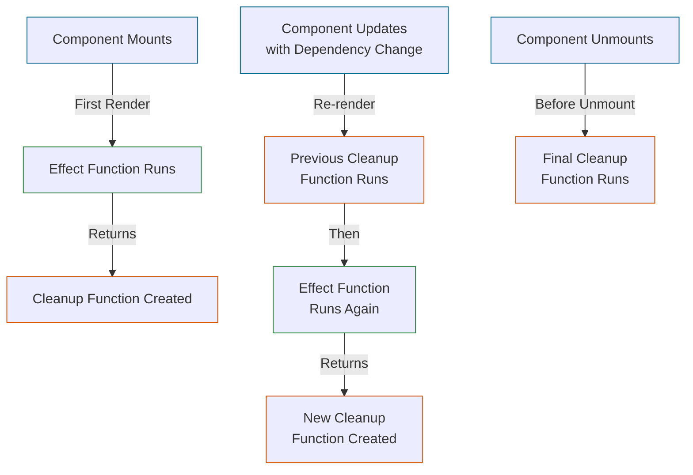
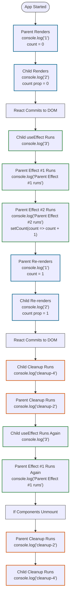

# how use effect cleanup life cycle work 




```jsx
import React, { useState, useEffect } from 'react';

function TimerComponent() {
  const [count, setCount] = useState(0);
  
  // Toggle this to demonstrate re-running effects
  const [enabled, setEnabled] = useState(true);

  useEffect(() => {
    // This log shows when the effect runs
    console.log('Effect function is running');
    
    // Setup phase - runs after render
    const timerId = setInterval(() => {
      console.log('Timer tick');
      setCount(prev => prev + 1);
    }, 1000);
    
    // Cleanup function - returned from effect
    return () => {
      console.log('Cleanup function is running');
      clearInterval(timerId);
    };
  }, [enabled]); // Dependency array - effect reruns when enabled changes
  
  return (
    <div>
      <h1>Count: {count}</h1>
      <button onClick={() => setEnabled(!enabled)}>
        {enabled ? 'Disable' : 'Enable'} Timer
      </button>
    </div>
  );
}

export default function App() {
  const [showTimer, setShowTimer] = useState(true);
  
  return (
    <div>
      <button onClick={() => setShowTimer(!showTimer)}>
        {showTimer ? 'Unmount' : 'Mount'} Timer Component
      </button>
      
      {showTimer && <TimerComponent />}
      
      <div style={{ marginTop: 20, padding: 10, backgroundColor: '#f0f0f0' }}>
        <h3>Order of Execution:</h3>
        <ol>
          <li>Component mounts → Effect function runs</li>
          <li>When dependency changes → Cleanup runs → Then effect runs again</li>
          <li>When component unmounts → Final cleanup runs</li>
        </ol>
      </div>
    </div>
  );
}

```

# useEffect Execution Flow with Cleanup Functions

The execution order of useEffect with cleanup functions follows a specific pattern that's important to understand for proper resource management. Here's the detailed flow:

## Initial Mount
1. Component renders for the first time
2. React updates the DOM 
3. Browser paints the screen
4. **Then** the effect function runs
5. The cleanup function is stored (but not run yet)

## Component Updates (when dependencies change)
1. Component re-renders
2. React updates the DOM
3. Browser paints the screen
4. **First**, the cleanup function from the previous render runs
5. **Then**, the new effect function runs
6. The new cleanup function is stored

## Component Unmount
1. React begins removing the component
2. **First**, the final cleanup function runs
3. Component is removed from the DOM

## Key Points About Cleanup Timing

- The cleanup function always runs **before** the effect runs again (except on first mount)
- The cleanup function always runs when the component unmounts
- Cleanup runs synchronously during updates but asynchronously during unmount
- Effect functions run after the browser paint, but cleanup functions run before the next paint

This pattern ensures that you can properly clean up resources (like subscriptions, timers, or event listeners) before setting up new ones or before the component is removed completely.

In the code example provided, you can see this flow in action with console logs that demonstrate the timing. You can toggle the component's state to see how the cleanup and effect functions run in response to dependency changes and component unmount.


``` js

import { useState, useEffect } from "react";

// Here's the code with numbered comments to help track execution order
function ChallengeOne() {
  const [count, setCount] = useState(0);
  console.log("1"); // Parent component rendering
  
  useEffect(() => {
    // Parent Effect #1 (with count dependency)
    console.log("Parent Effect #1 runs"); // Not in original code but added for clarity
    return () => {
      console.log("cleanup-2"); // Cleanup for Parent Effect #1
    };
  }, [count]);

  useEffect(() => {
    // Parent Effect #2 (runs once)
    console.log("Parent Effect #2 runs"); // Not in original code but added for clarity
    setCount((count) => count + 1);
  }, []);

  return <Child count={count} />;
}

export function Child({ count }) {
  console.log("2"); // Child component rendering (added for clarity)
  
  useEffect(() => {
    console.log("3"); // Child Effect runs
    return () => {
      console.log("cleanup-4"); // Cleanup for Child Effect
    };
  }, [count]);
  
  return null;
}
  
  export default ChallengeOne;

```

<details>
<summary><b>Explanation<b></summary>

# explanation 

`Mounting Lifecycle (render lifecycle)` 

1 => 2 => 3 => Parent Effect #1 runs => Parent Effect #2 runs 

`Updating lifecycle (re render life cycle)` 

1 =>2 => cleanup-4 => cleanup-2 => 3 => Parent Effect #1 runs 

You're absolutely right. Let me correct my explanation to match the actual output sequence that would occur. I'll be more precise about the cleanup and effect order.

# Corrected useEffect Lifecycle Breakdown

Here's the accurate sequence based on how React actually handles effects and cleanups:

## First Render Cycle:

1. **`console.log("1")`** - Parent component body executes
   * `count` starts at `0`

2. **`console.log("2")`** - Child component body executes
   * Receives `count={0}` as prop

3. **React commits this render to the DOM**

4. **`console.log("3")`** - Child's useEffect executes
   * The cleanup function is stored but not run yet

5. **`console.log("Parent Effect #1 runs")`** - Parent's first effect runs
   * The cleanup function is stored but not run yet

6. **`console.log("Parent Effect #2 runs")`** - Parent's second effect runs
   * Calls `setCount(count => count + 1)` which triggers a re-render

## Second Render Cycle (triggered by state update):

7. **`console.log("1")`** - Parent component body executes again
   * Now `count` is `1`

8. **`console.log("2")`** - Child component body executes again
   * Now receives `count={1}` as prop

9. **Before effects run for the second render, cleanup functions from previous effects run:**
   * **`console.log("cleanup-4")`** - Child's cleanup function runs first
   * **`console.log("cleanup-2")`** - Parent's first effect cleanup runs immediately after

10. **After all cleanups complete, new effects run:**
    * **`console.log("3")`** - Child's useEffect runs again
    * **`console.log("Parent Effect #1 runs")`** - Parent's first effect runs again
    * Parent's second effect does NOT run again (empty dependency array)

## Complete Console Output:

```
1                     // Parent renders with count=0
2                     // Child renders with count=0
3                     // Child effect runs after first commit
Parent Effect #1 runs // Parent's first effect runs
Parent Effect #2 runs // Parent's second effect runs (triggers state update)
1                     // Parent re-renders with count=1
2                     // Child re-renders with count=1
cleanup-4             // Child cleanup runs first
cleanup-2             // Then Parent cleanup runs
3                     // Then Child effect runs again
Parent Effect #1 runs // Then Parent effect runs again
```

## Key Correction:

The critical point I missed is that React runs **all cleanup functions first** before running **any** new effects. The order is:

1. All component bodies render
2. React commits to DOM
3. All cleanup functions run (in order: children, then parents)
4. All effect functions run (in order: children, then parents)

This explains why we see `cleanup-4` followed immediately by `cleanup-2`, and only then do we see `3` followed by `Parent Effect #1 runs`. React completes the cleanup phase before starting the effect phase.




# Keys phases of above diagram 

### 1. Initial Rendering Phase
- Parent component renders first (`console.log("1")`)
- Child component renders next (`console.log("2")`)
- React commits these components to the DOM

### 2. First Effects Phase (after initial render)
- Child's useEffect runs first (`console.log("3")`)
- Parent's first effect runs (`console.log("Parent Effect #1 runs")`)
- Parent's second effect runs (`console.log("Parent Effect #2 runs")`) and updates state

### 3. Re-rendering Phase (triggered by state update)
- Parent re-renders with updated count (`console.log("1")`)
- Child re-renders with new count prop (`console.log("2")`)
- React commits the updated components to the DOM

### 4. Cleanup Phase (before new effects)
- Child's cleanup function runs first (`console.log("cleanup-4")`)
- Parent's cleanup function runs next (`console.log("cleanup-2")`)

### 5. Second Effects Phase
- Child's useEffect runs again (`console.log("3")`)
- Parent's first effect runs again (`console.log("Parent Effect #1 runs")`)
- Parent's second effect doesn't run (empty dependency array)

### 6. Potential Unmount Phase
- If the components unmount, cleanup functions run:
  - Parent cleanup runs (`console.log("cleanup-2")`)
  - Child cleanup runs (`console.log("cleanup-4")`)

## Important React Behavior Shown:

1. **Component rendering order**: Parent to child
2. **Effect execution order**: Child to parent (after render is committed)
3. **Cleanup execution order**: Child to parent (before next effects run)
4. **Complete cleanup before effects**: All cleanup functions run before any new effects

This diagram captures React's "effects lifecycle" with the unique parent-child relationship, showing how effects and their cleanup functions interact when dependencies change or components unmount.

</details>


# Second variation 


```jsx
// Here's the code with numbered comments to help track execution order

function ChallengeOne() {
    const [count, setCount] = useState(0);
    console.log("1");
    useEffect(() => {
      return () => {
        console.log("cleanup-2");
      };
    }, [count]);

    useEffect(() => {
      setCount((count) => count + 1);
    }, []);

    return <Child count={count} />;
  }

  export function Child({ count }) {
    useEffect(() => {
      console.log("3");
      return () => {
        console.log("cleanup-4");
      };
    }, [count]);
    return null;
  }

```

# Detailed useEffect Lifecycle Breakdown

Let me break down exactly what happens with this component pair, showing the sequence of console logs and explaining why they occur in that order:

## Initial Rendering Phase:

1. **`console.log("1")`** - First, the parent `ChallengeOne` component body executes during rendering
   - `count` is initialized to `0`

2. **Child component renders** (with `count={0}`)
   - The Child component body executes

3. **React commits this render to the DOM**
   - Both components are now mounted with their initial values

## Effects Phase (After First Render):

4. **Child's useEffect runs**
   - `console.log("3")` executes
   - The cleanup function is stored but not yet executed

5. **Parent's first useEffect runs** (the one with `[count]` dependency)
   - Its cleanup function is stored but not yet executed

6. **Parent's second useEffect runs** (the one with `[]` empty dependency)
   - It calls `setCount(count => count + 1)`, which triggers a re-render
   - This changes `count` from `0` to `1`

## Second Rendering Phase (due to state update):

7. **`console.log("1")`** - Parent component body re-executes
   - Now `count` is `1`

8. **Child component re-renders** (with `count={1}`)

9. **React commits this render to the DOM**

## Effects Cleanup Phase (Before Effects Run Again):

10. **Child's cleanup function runs**
    - `console.log("cleanup-4")` executes
    - This happens because `count` changed from `0` to `1`, and it's in the dependency array

11. **Parent's first useEffect cleanup runs**
    - `console.log("cleanup-2")` executes
    - This also happens because `count` changed and is in the dependency array

## Effects Phase (After Second Render):

12. **Child's useEffect runs again**
    - `console.log("3")` executes again
    - New cleanup function is stored

13. **Parent's first useEffect runs again**
    - New cleanup function is stored

14. **Parent's second useEffect does NOT run again**
    - Its dependency array is empty, so it only runs on mount

## If Component Unmounts:

If the entire component tree unmounts:

15. **Parent's first useEffect cleanup runs**
    - `console.log("cleanup-2")` executes

16. **Child's useEffect cleanup runs**
    - `console.log("cleanup-4")` executes

## Full Console Output Sequence:

```
1                 // Parent rendering with count=0
[Child renders]    // No console log in original code
3                 // Child useEffect runs after first render
[Parent effects run] // No console logs in original code but effects execute
1                 // Parent re-renders due to setCount
[Child re-renders]  // No console log in original code
cleanup-4         // Child cleanup runs before effects due to count change
cleanup-2         // Parent cleanup runs before effects due to count change
3                 // Child useEffect runs again after second render
```

## Key Insights:

1. **The state update in the second useEffect causes an additional render cycle** - This is why we see two rounds of effects running

2. **Cleanup functions run before the next effect execution** - When dependencies change, React runs the cleanup before running the effect again

3. **Parent and child effects interleave** - React runs all effects in the order they appear in the component tree, not by component

4. **Empty dependency arrays (`[]`) only run once** - This is why the second effect in the parent doesn't run again despite the re-render

This example demonstrates the complete React effects lifecycle including initialization, updates due to state changes, and the cleanup phase.


