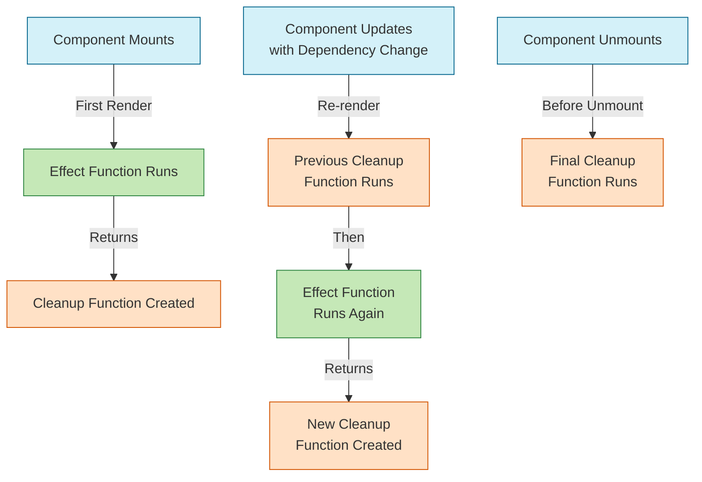

# how use effect cleanup life cycle work 




```jsx
import React, { useState, useEffect } from 'react';

function TimerComponent() {
  const [count, setCount] = useState(0);
  
  // Toggle this to demonstrate re-running effects
  const [enabled, setEnabled] = useState(true);

  useEffect(() => {
    // This log shows when the effect runs
    console.log('Effect function is running');
    
    // Setup phase - runs after render
    const timerId = setInterval(() => {
      console.log('Timer tick');
      setCount(prev => prev + 1);
    }, 1000);
    
    // Cleanup function - returned from effect
    return () => {
      console.log('Cleanup function is running');
      clearInterval(timerId);
    };
  }, [enabled]); // Dependency array - effect reruns when enabled changes
  
  return (
    <div>
      <h1>Count: {count}</h1>
      <button onClick={() => setEnabled(!enabled)}>
        {enabled ? 'Disable' : 'Enable'} Timer
      </button>
    </div>
  );
}

export default function App() {
  const [showTimer, setShowTimer] = useState(true);
  
  return (
    <div>
      <button onClick={() => setShowTimer(!showTimer)}>
        {showTimer ? 'Unmount' : 'Mount'} Timer Component
      </button>
      
      {showTimer && <TimerComponent />}
      
      <div style={{ marginTop: 20, padding: 10, backgroundColor: '#f0f0f0' }}>
        <h3>Order of Execution:</h3>
        <ol>
          <li>Component mounts → Effect function runs</li>
          <li>When dependency changes → Cleanup runs → Then effect runs again</li>
          <li>When component unmounts → Final cleanup runs</li>
        </ol>
      </div>
    </div>
  );
}

```

# useEffect Execution Flow with Cleanup Functions

The execution order of useEffect with cleanup functions follows a specific pattern that's important to understand for proper resource management. Here's the detailed flow:

## Initial Mount
1. Component renders for the first time
2. React updates the DOM 
3. Browser paints the screen
4. **Then** the effect function runs
5. The cleanup function is stored (but not run yet)

## Component Updates (when dependencies change)
1. Component re-renders
2. React updates the DOM
3. Browser paints the screen
4. **First**, the cleanup function from the previous render runs
5. **Then**, the new effect function runs
6. The new cleanup function is stored

## Component Unmount
1. React begins removing the component
2. **First**, the final cleanup function runs
3. Component is removed from the DOM

## Key Points About Cleanup Timing

- The cleanup function always runs **before** the effect runs again (except on first mount)
- The cleanup function always runs when the component unmounts
- Cleanup runs synchronously during updates but asynchronously during unmount
- Effect functions run after the browser paint, but cleanup functions run before the next paint

This pattern ensures that you can properly clean up resources (like subscriptions, timers, or event listeners) before setting up new ones or before the component is removed completely.

In the code example provided, you can see this flow in action with console logs that demonstrate the timing. You can toggle the component's state to see how the cleanup and effect functions run in response to dependency changes and component unmount.


``` js

import { useState, useEffect } from "react";

function ChallengeOne() {
    const [count, setCount] = useState(0);
    console.log("1");
    useEffect(() => {
      return () => {
        console.log("cleanup-2");
      };
    }, [count]);
  
    useEffect(() => {
      setCount((count) => count + 1);
    }, []);
  
    return <Child count={count} />;
  }
  
  export function Child({ count }) {
    useEffect(() => {
      console.log("3");
      return () => {
        console.log("cleanup-4");
      };
    }, [count]);
    return null;
  }
  
  export default ChallengeOne;

```

