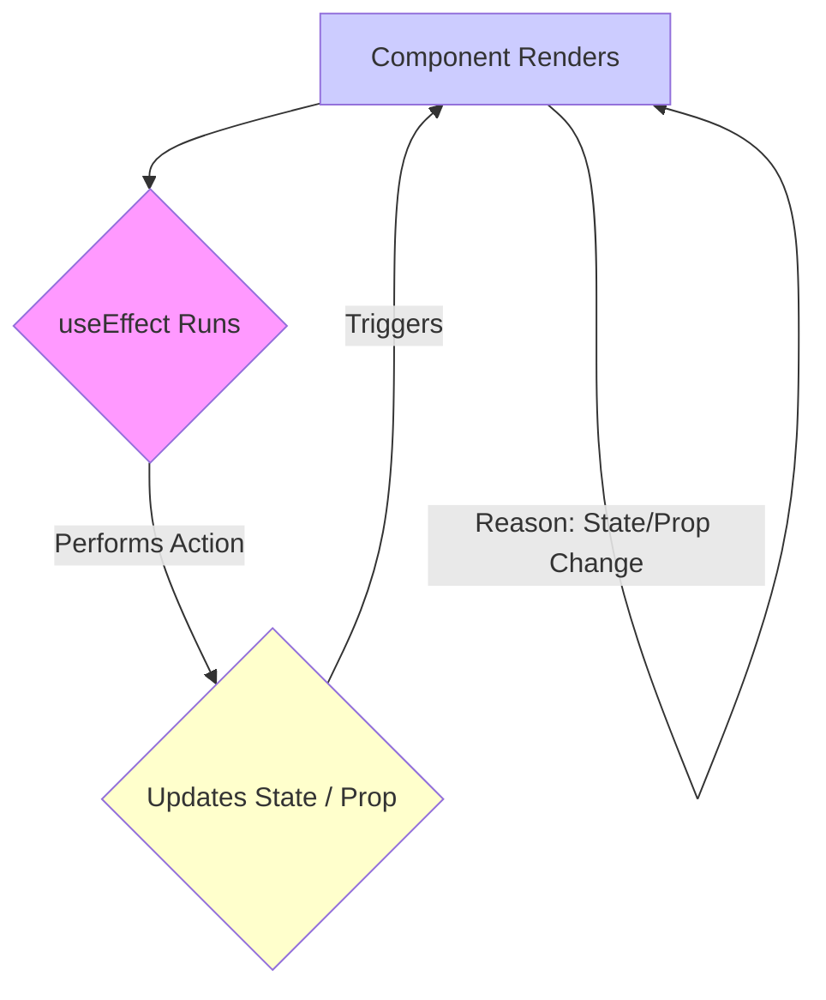

# Pitfall: Infinite Loops in `useEffect`

## Introduction

One of the most common pitfalls when working with the `useEffect` Hook in React is accidentally creating an infinite loop. This happens when an effect modifies state or performs an action that, in turn, causes the effect to run again, leading to a cycle of updates and re-renders that never stops.

These loops can freeze the browser, cause excessive API calls, and make the application unresponsive.

## Common Causes and Solutions

### 1. Missing or Incorrect Dependency Array

- **Cause:** If you omit the dependency array, the effect runs after *every* render. If the effect updates state, it triggers another render, causing the effect to run again, and so on.
- **Cause:** If the dependency array is incorrect (e.g., missing a value the effect reads), the effect might run with stale data and trigger unnecessary updates, or fail to run when it should.
- **Solution:** Always provide a dependency array. Include *all* values from the component scope (props, state, functions) that are used inside the effect and could change over time. ESLint rules (`react-hooks/exhaustive-deps`) are crucial for catching this.

**Incorrect Code (Missing Dependency):**
```jsx
import React, { useState, useEffect } from 'react';

function BadEffectLoop({ userId }) {
  const [user, setUser] = useState(null);

  useEffect(() => {
    console.log('Fetching user data...'); // Runs on every render!
    fetch(`https://jsonplaceholder.typicode.com/users/${userId}`)
      .then(res => res.json())
      .then(data => setUser(data));
    // 🔴 Missing [userId] dependency. If userId prop changes,
    // this effect won't re-run with the new ID.
    // If setUser triggers a re-render, this effect runs *again* unnecessarily.
  }); // << No dependency array!

  return <p>User: {user ? user.name : 'Loading...'}</p>;
}
```

**Corrected Code:**
```jsx
import React, { useState, useEffect } from 'react';

function GoodEffectDependency({ userId }) {
  const [user, setUser] = useState(null);

  useEffect(() => {
    console.log(`Fetching user data for ID: ${userId}...`);
    fetch(`https://jsonplaceholder.typicode.com/users/${userId}`)
      .then(res => res.json())
      .then(data => setUser(data));
    // ✅ Correct: Effect re-runs only when userId changes.
  }, [userId]); // << Dependency array provided

  return <p>User: {user ? user.name : 'Loading...'}</p>;
}
```

### 2. State Update Within Effect Triggers the Same Effect

- **Cause:** The effect updates a state variable, and that same state variable is included in the effect's dependency array. This creates a direct loop: render -> effect runs -> state updates -> render -> effect runs -> ...
- **Solution:**
    - **Functional State Updates:** If the state update depends on the previous state, use the functional form of the state setter (`setState(prevState => newState)`). This often allows you to remove the state variable itself from the dependency array, breaking the loop.
    - **Refactor Logic:** Re-evaluate if the state update truly needs to happen inside *this* specific effect or if the logic can be restructured.

**Incorrect Code (Direct Loop):**
```jsx
import React, { useState, useEffect } from 'react';

function CounterLoop() {
  const [count, setCount] = useState(0);

  useEffect(() => {
    console.log('Effect running, updating count...');
    // 🔴 INCORRECT: Updates `count`, which is a dependency.
    setCount(count + 1); 
  }, [count]); // << Depends on count

  return <p>Count: {count}</p>; // This will loop infinitely
}
```

**Corrected Code (Using Functional Update):**
```jsx
import React, { useState, useEffect } from 'react';

function CounterNoLoop() {
  const [count, setCount] = useState(0);

  useEffect(() => {
    console.log('Effect running, setting up interval...');
    const intervalId = setInterval(() => {
        // ✅ CORRECT: Functional update doesn't need `count` in scope.
        setCount(prevCount => prevCount + 1); 
    }, 1000);

    return () => clearInterval(intervalId);
  // ✅ Correct: Dependency array is empty, effect runs once on mount.
  }, []); // << No dependency on count needed

  return <p>Count: {count}</p>;
}
```

### 3. Unstable Dependencies (Objects, Arrays, Functions)

- **Cause:** If you include objects, arrays, or functions defined *inside* the component body in the dependency array, they might be recreated on every render. Since they are new references/instances each time, the dependency array comparison fails (`{} !== {}`), causing the effect to run again even if the underlying data hasn't changed.
- **Solution:**
    - **Memoization:** Wrap the object/array creation with `useMemo` or the function definition with `useCallback` so that they maintain the same reference between renders unless their own dependencies change.
    - **Primitives:** If possible, depend on primitive values (strings, numbers) derived from the objects/arrays instead of the objects/arrays themselves.
    - **Move outside:** If the object/array/function doesn't depend on props or state, define it outside the component.

**Incorrect Code (Unstable Function Dependency):**
```jsx
import React, { useState, useEffect } from 'react';

function UnstableDependencyDemo() {
  const [userId, setUserId] = useState(1);

  // 🔴 INCORRECT: fetchData is redefined on every render
  const fetchData = () => {
    console.log(`Fetching data for user ${userId}...`);
    // fetch(...)
  };

  useEffect(() => {
    fetchData();
  }, [fetchData]); // << Dependency on unstable function reference
  // This effect runs on *every* render because fetchData is always new.

  return (
    <div>
      <p>User ID: {userId}</p>
      <button onClick={() => setUserId(id => id + 1)}>Change User ID</button>
    </div>
  );
}
```

**Corrected Code (Using `useCallback`):**
```jsx
import React, { useState, useEffect, useCallback } from 'react';

function StableDependencyDemo() {
  const [userId, setUserId] = useState(1);

  // ✅ CORRECT: fetchData reference is stable unless userId changes
  const fetchData = useCallback(() => {
    console.log(`Fetching data for user ${userId}...`);
    // fetch(...)
  }, [userId]); // Include userId as fetchData depends on it

  useEffect(() => {
    fetchData();
    // Effect now only runs when the *memoized* fetchData function changes
    // (which only happens when userId changes).
  }, [fetchData]); 

  return (
    <div>
      <p>User ID: {userId}</p>
      <button onClick={() => setUserId(id => id + 1)}>Change User ID</button>
    </div>
  );
}
```

## Diagram: Infinite Loop Cycle



## Conclusion

Infinite loops in `useEffect` usually stem from incorrectly specified dependencies or effects that trigger themselves without a proper exit condition. Carefully managing the dependency array, using functional state updates, and memoizing non-primitive dependencies (`useMemo`, `useCallback`) are key strategies to prevent this common pitfall. 