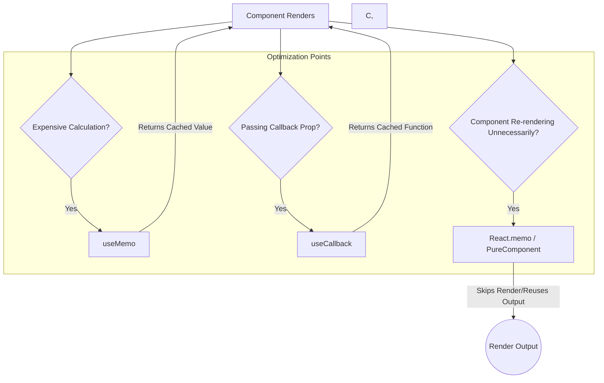

# Optimization: Memoization

## Introduction

Memoization is a powerful optimization technique used to speed up applications by caching the results of expensive function calls or component renders and returning the cached result when the same inputs occur again.

React provides several tools to implement memoization, preventing unnecessary re-computations and re-renders, which can significantly improve performance, especially in complex components or applications with frequent updates.

The main memoization tools in React are:
- **`React.memo()`:** For function components.
- **`useMemo()`:** For memoizing the *result* of a function call (a value).
- **`useCallback()`:** For memoizing a *callback function* itself.

(Class components use `React.PureComponent` or `shouldComponentUpdate` for similar purposes - see that topic).

## 1. `React.memo()`

- **Purpose:** A Higher-Order Component (HOC) primarily used to optimize function components.
- **How it Works:** `React.memo` wraps a component and memoizes its rendered output. It then compares the component's previous props with its next props. If the props are the same (using a shallow comparison by default), React reuses the memoized result from the last render, skipping the component's render phase entirely.
- **Syntax:**
    ```jsx
    const MyMemoizedComponent = React.memo(MyComponent, arePropsEqual?);
    ```
    - `MyComponent`: The function component to wrap.
    - `arePropsEqual` (optional): A custom comparison function `(prevProps, nextProps) => boolean`. If provided, it overrides the default shallow comparison. Return `true` if props are equal (prevent re-render), `false` otherwise.
- **Use Case:** Preventing re-renders of a component when its props haven't changed, especially useful for components that render often or are computationally expensive to render.

```jsx
import React, { useState } from 'react';

// Component to be memoized
const DisplayUserInfo = ({ user }) => {
  console.log(`Rendering DisplayUserInfo for ${user.name}...`);
  return (
    <div style={{ border: '1px dashed blue', padding: '5px', margin: '5px' }}>
      <p>ID: {user.id}</p>
      <p>Name: {user.name}</p>
    </div>
  );
};

// Memoize the component
// It will only re-render if the `user` prop changes reference
const MemoizedDisplayUserInfo = React.memo(DisplayUserInfo);

function MemoDemoParent() {
  const [user, setUser] = useState({ id: 1, name: 'Alice' });
  const [counter, setCounter] = useState(0); // To trigger parent re-renders

  const updateUser = () => {
    // Create a new user object reference
    setUser({ id: 1, name: `Alice-${Date.now()}` });
  };

  const incrementCounter = () => {
    setCounter(c => c + 1);
  };

  console.log('Rendering MemoDemoParent...');

  return (
    <div>
      <h2>React.memo Demo</h2>
      <button onClick={updateUser}>Update User Name</button>
      <button onClick={incrementCounter}>Increment Counter (Re-render Parent) ({counter})</button>
      
      {/* Regular component - re-renders whenever parent renders */}
      {/* <DisplayUserInfo user={user} /> */}
      
      {/* Memoized component - only re-renders when `user` prop reference changes */}
      <MemoizedDisplayUserInfo user={user} />
      
      <p>Observe console: Memoized component only renders when user name is updated, not when counter increments.</p>
    </div>
  );
}

export default MemoDemoParent;
```

## 2. `useMemo()`

- **Purpose:** Memoizes the *result* of a function call within your component.
- **How it Works:** Takes a function and a dependency array. It calls the function and returns its result during the initial render. On subsequent renders, it only re-calls the function if one of the dependencies has changed; otherwise, it returns the cached result from the previous render.
- **Syntax:** `const memoizedValue = useMemo(() => computeExpensiveValue(dep1, dep2), [dep1, dep2]);`
- **Use Case:**
    - Skipping expensive calculations (e.g., filtering/sorting large arrays, complex data transformations) if inputs haven't changed.
    - Ensuring stable references for objects or arrays passed down as props to memoized child components (preventing unnecessary child re-renders).

**(See Advanced Hooks topic for code example)**

## 3. `useCallback()`

- **Purpose:** Memoizes a *callback function* itself.
- **How it Works:** Takes a callback function and a dependency array. It returns the same function instance between renders as long as its dependencies haven't changed.
- **Syntax:** `const memoizedCallback = useCallback(() => { doSomething(dep1); }, [dep1]);`
- **Use Case:**
    - Preventing unnecessary re-renders of child components (optimized with `React.memo` or `PureComponent`) that receive callbacks as props. Without `useCallback`, the parent creates a new function instance on every render, breaking the child's memoization.
    - Ensuring stable function references for dependency arrays in other Hooks like `useEffect`.

**(See Advanced Hooks topic for code example)**

## Relationship Between Them

- `React.memo` optimizes the component render itself based on props.
- `useMemo` optimizes calculating *values* needed during render.
- `useCallback` optimizes *function references* passed as props or used in effects.

Often, `useMemo` and `useCallback` are used *within* a parent component to ensure that the props passed to a child component wrapped in `React.memo` are stable, allowing `React.memo` to effectively skip renders.

```jsx
function Parent() {
  const [data, setData] = useState(...);
  const [filter, setFilter] = useState(...);

  // Memoize derived data object passed to child
  const childData = useMemo(() => ({ 
      info: data.id, 
      /* other derived props */ 
  }), [data.id]);

  // Memoize callback passed to child
  const handleChildAction = useCallback(() => {
    console.log('Action for filter:', filter);
    // ...
  }, [filter]);

  return <MemoizedChild data={childData} onAction={handleChildAction} />;
}

const MemoizedChild = React.memo(({ data, onAction }) => {
  // ... renders using data and onAction ...
});
```

## Diagram: Memoization Tools



## When to Memoize?

- **Don't Prematurely Optimize:** Memoization adds complexity. Only apply it when you've identified a real performance bottleneck using profiling tools.
- **Expensive Computations:** `useMemo` is great for calculations that are noticeably slow.
- **Referential Equality:** `useMemo` and `useCallback` are crucial for maintaining stable references when passing non-primitive props to memoized children.
- **Component Render Cost:** `React.memo` is most effective for components that:
    - Render frequently.
    - Render with the same props often.
    - Are reasonably expensive to render themselves.

Overusing memoization, especially for simple components or inexpensive calculations, can sometimes add more overhead than it saves. 