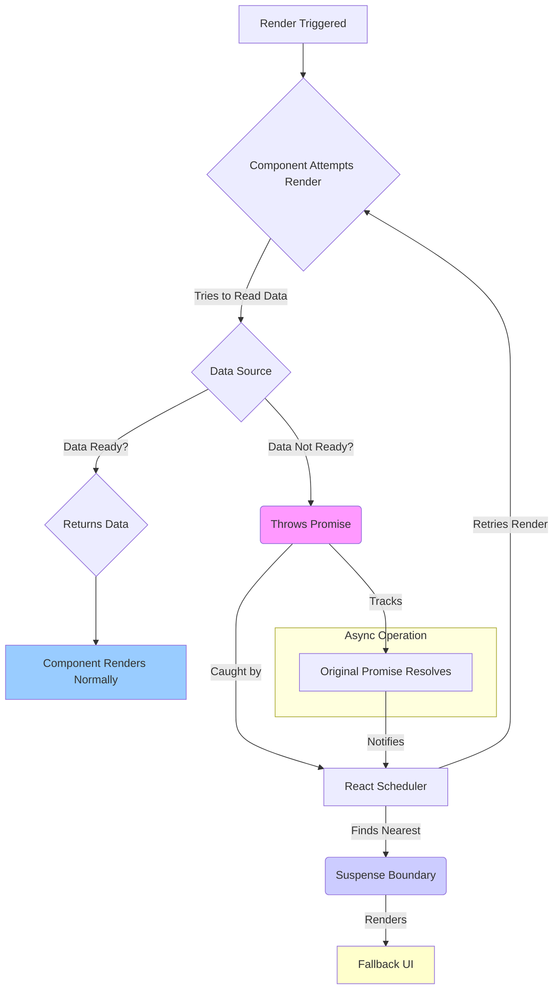

# React 18+: Suspense for Data Fetching

## Introduction

While `React.Suspense` was initially introduced for code splitting (`React.lazy`), React 18 significantly expands its capabilities to handle asynchronous operations, most notably data fetching.

Suspense for Data Fetching allows components to declaratively "wait" for data to be ready before rendering, showing a fallback UI (like a loading spinner) in the meantime. This integrates data loading directly into the rendering process, enabling more coordinated loading states across the component tree.

**Important Note:** As of late 2023 / early 2024, using Suspense for data fetching directly within client-side components often requires integration with specific data-fetching libraries or frameworks (like Relay, Next.js with Server Components, Remix) that implement the Suspense contract. Standalone client-side data fetching with Suspense without such libraries is possible but can be complex to implement correctly (involving throwing promises).

## Core Concept: Render-as-You-Fetch

Suspense enables a pattern often called "Render-as-You-Fetch". Instead of the traditional "Fetch-on-Render" (component mounts -> starts fetch -> shows loading state -> updates state when done) or "Fetch-then-Render" (fetch data before rendering the route), Render-as-You-Fetch aims to start fetching data *as early as possible*, potentially even before the component needing the data starts rendering.

1.  **Start Fetching Early:** Initiate data fetching (e.g., in response to an event handler, route transition).
2.  **Start Rendering:** Begin rendering the next screen/component immediately, *without* waiting for the fetch to complete.
3.  **Component Reads Data:** The component attempts to read the data it needs from a Suspense-enabled source.
4.  **Suspend:** If the data is not yet ready, the component "suspends" rendering. React catches this suspension.
5.  **Show Fallback:** React traverses up the tree to find the nearest `<Suspense>` boundary and displays its `fallback` UI.
6.  **Resume Rendering:** Once the data fetch completes, React resumes rendering the component (which can now successfully read the data) and replaces the fallback UI with the actual component content.

## Benefits

- **Declarative Loading States:** Define loading UI declaratively using `<Suspense>` boundaries instead of manually managing `isLoading` boolean states in every component.
- **Avoid Race Conditions:** Helps manage complex loading scenarios where multiple components fetch data concurrently.
- **Improved Perceived Performance:** Can show parts of the UI earlier while data for other parts is still loading.
- **Coordinated Loading:** Enables orchestrating loading states across different parts of the component tree (e.g., showing a single spinner for multiple data-fetching children).
- **Better User Experience:** Reduces layout shifts and flashes of loading indicators compared to managing boolean flags individually.

## How it Works Under the Hood (Simplified)

Suspense-enabled data sources work by integrating with React's internal mechanisms:
- When a component tries to read data that isn't ready, the data source **throws a Promise**. This special thrown Promise signals to React that the component needs to suspend.
- React catches this Promise.
- React uses the `<Suspense>` boundary to show the fallback.
- When the thrown Promise resolves (meaning the data is ready), React knows it can try rendering the suspended component again.

Manually implementing this promise-throwing mechanism is complex and error-prone, which is why using integrated libraries/frameworks is generally recommended.

## Diagram: Suspense Data Fetching Flow



## Code Example (Conceptual - Using a Library/Framework)

This example uses a hypothetical Suspense-enabled data-fetching library (`suspenseFetch`) to illustrate the concept. **This will not work out-of-the-box without a real library implementing the Suspense contract.**

```jsx
import React, { Suspense } from 'react';

// Assume `createResource` or similar exists in a library
// It returns an object with a `read()` method that suspends if data isn't ready
// const userResource = createResource(() => fetch('...').then(res => res.json()));

// --- Hypothetical Library --- 
// This is a simplified mock to demonstrate the concept
const createResource = (asyncFn) => {
  let status = 'pending';
  let result;
  let promise = asyncFn().then(
    (r) => { status = 'success'; result = r; },
    (e) => { status = 'error'; result = e; }
  );
  return {
    read() {
      if (status === 'pending') throw promise; // Suspend!
      if (status === 'error') throw result; // Error!
      if (status === 'success') return result; // Data!
    }
  };
};
// --- End Hypothetical Library ---

// Fetch user data resource
const userResource = createResource(() => 
    fetch('https://jsonplaceholder.typicode.com/users/1').then(res => res.json())
);

// Fetch posts data resource
const postsResource = createResource(() => 
    fetch('https://jsonplaceholder.typicode.com/posts?_limit=5').then(res => res.json())
);

function UserProfile() {
  // Attempt to read user data. This will suspend if data isn't ready.
  const user = userResource.read(); 
  console.log('Rendering UserProfile - User data ready');
  return (
    <div>
      <h3>User: {user.name}</h3>
      <p>Email: {user.email}</p>
    </div>
  );
}

function UserPosts() {
  // Attempt to read posts data. This will suspend if data isn't ready.
  const posts = postsResource.read();
  console.log('Rendering UserPosts - Posts data ready');
  return (
    <div>
      <h4>Posts:</h4>
      <ul>
        {posts.map(post => <li key={post.id}>{post.title}</li>)}
      </ul>
    </div>
  );
}

function SuspenseDataDemo() {
  console.log('Rendering SuspenseDataDemo');
  return (
    <div>
      <h1>Suspense for Data Fetching Demo</h1>
      
      {/* Outer boundary for user profile */}
      <Suspense fallback={<p>Loading user profile...</p>}>
        <UserProfile />
        
        {/* Nested boundary for posts - can show user profile first */}
        <Suspense fallback={<p>Loading posts...</p>}>
          <UserPosts />
        </Suspense>
      </Suspense>
      
      <p>Other page content that renders immediately.</p>
    </div>
  );
}

export default SuspenseDataDemo;
```

## Conclusion

Suspense for Data Fetching represents a significant shift towards more declarative handling of loading states in React. By allowing components to suspend rendering while waiting for data, it enables better coordination of loading indicators, reduces boilerplate `isLoading` logic, and facilitates advanced UI patterns like Render-as-You-Fetch, especially when used with compatible frameworks and data-fetching libraries. 