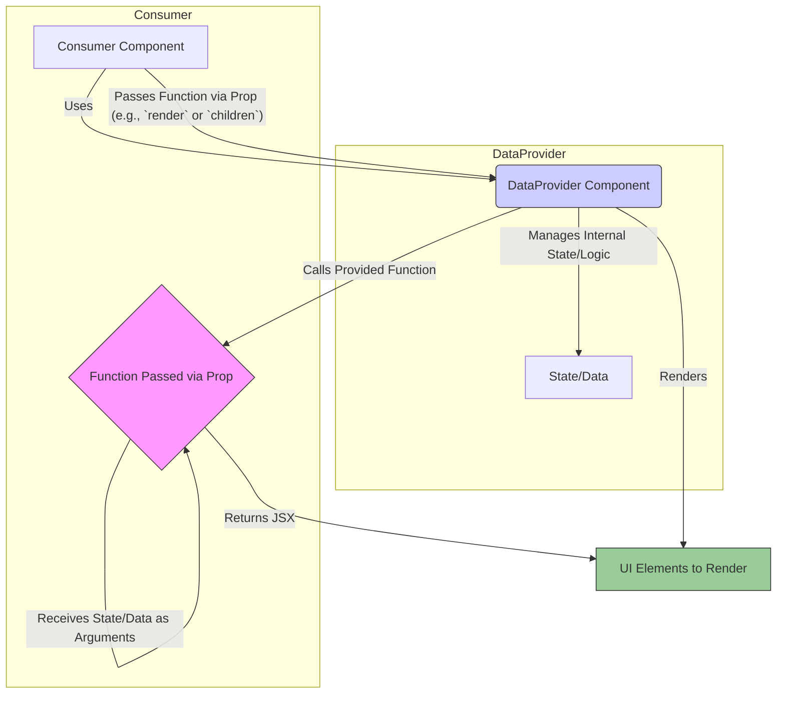

# Render Props

## Introduction

Render Props is a technique in React for sharing code between components using a prop whose value is a function. A component with a render prop takes a function that returns a React element and calls it instead of implementing its own render logic.

This pattern allows components to share or delegate rendering logic and stateful behavior in a flexible and reusable way. It was more common before Hooks offered a more direct way to share stateful logic (Custom Hooks), but it's still a powerful and valid pattern.

## How it Works

1.  **Provider Component:** A component (let's call it `DataProvider`) encapsulates some state or behavior.
2.  **Function Prop:** Instead of rendering something specific itself, `DataProvider` accepts a prop (commonly named `render` or `children`, but can be any prop name) which is expected to be a function.
3.  **Call the Function:** Inside its own render logic, `DataProvider` calls the function passed via the prop, potentially passing its internal state or data as arguments to that function.
4.  **Consumer Component:** The component using `DataProvider` passes a function as the specified prop. This function receives the data/state from `DataProvider` and returns the JSX that should be rendered.

This effectively inverts control: the `DataProvider` manages the *data* or *behavior*, but the *consumer* decides *what* gets rendered using that data/behavior.

## Diagram: Render Prop Flow



## Code Example: Mouse Tracker

A classic example is a component that tracks mouse position and makes it available to other components.

```jsx
import React, { useState, useEffect } from 'react';

// 1. The component encapsulating the behavior (tracking mouse position)
function MouseTracker({ render }) { // Accepts a 'render' prop (could be 'children' too)
  const [position, setPosition] = useState({ x: 0, y: 0 });

  useEffect(() => {
    const handleMouseMove = (event) => {
      setPosition({ x: event.clientX, y: event.clientY });
    };

    window.addEventListener('mousemove', handleMouseMove);
    console.log('Mouse listener added');

    return () => {
      window.removeEventListener('mousemove', handleMouseMove);
      console.log('Mouse listener removed');
    };
  }, []); // Empty dependency array means this effect runs once on mount

  // 3. Calls the render prop function, passing the internal state
  return render(position);
}

// 4. A component that uses MouseTracker to render the position
function DisplayMousePosition() {
  return (
    <MouseTracker
      render={mousePosition => (
        // This function receives the position and decides how to render it
        <div>
          <h1>Move the mouse around!</h1>
          <p>The current mouse position is ({mousePosition.x}, {mousePosition.y})</p>
        </div>
      )}
    />
  );
}

// Another component using the same tracker for a different rendering
function CatFollowingMouse() {
  return (
    <MouseTracker
      render={mousePosition => (
        
      )}
    />
  );
}

// App component demonstrating multiple uses
function App() {
  return (
    <div>
      <DisplayMousePosition />
      {/* You can have multiple independent trackers or share one if needed */}
      <CatFollowingMouse />
    </div>
  );
}

export default App;
```

**Alternative using `children` as a function:**

Sometimes, the `children` prop is used instead of a prop named `render`.

```jsx
// MouseTracker definition is the same, just call `children` instead of `render`
// function MouseTracker({ children }) { ... return children(position); }

function DisplayMousePositionAlt() {
  return (
    <MouseTracker>
      {mousePosition => (
        // Function passed as children
        <div>
          The position is ({mousePosition.x}, {mousePosition.y})
        </div>
      )}
    </MouseTracker>
  );
}
```

Render props provide a clean way to invert control and reuse stateful logic without relying on inheritance or mixins. 