# Rules of Hooks

## Introduction

Hooks provide powerful capabilities to function components, but they rely on React being able to preserve state and call effects consistently between renders. To ensure this works correctly, React enforces two fundamental rules.

Linting tools (like `eslint-plugin-react-hooks`) are typically configured to automatically enforce these rules in your codebase.

## Rule 1: Only Call Hooks at the Top Level

**Don't call Hooks inside loops, conditions, or nested functions.**

- **Why?** React relies on the **order** in which Hooks are called being the same on every render of a component. Calling hooks conditionally or in loops would change this order, leading to unpredictable behavior where React might associate state or effects with the wrong Hook call from a previous render.
- **How to Fix:**
    - If you need conditional logic, move the condition *inside* the Hook if possible (e.g., `useEffect(() => { if (condition) { /* effect */ } }, [deps]);`).
    - Or, move the conditional logic *outside* the Hook call, potentially returning early from the component or setting conditional variables used by the Hook's dependencies.

**Incorrect Code (Violates Rule 1):**

```jsx
function BadConditionalHook({ showEffect, data }) {
  // 🔴 INCORRECT: Calling useEffect conditionally
  if (showEffect) {
    useEffect(() => {
      console.log('Effect runs based on data:', data);
      // ... subscribe ...
      return () => { /* ... unsubscribe ... */ };
    }, [data]); 
  }

  // Imagine another hook here:
  // const [name, setName] = useState('Alice');
  // If showEffect becomes false, the useState call above would become the first hook call,
  // but React expects the useEffect to be first based on the previous render.

  return <p>Check console</p>;
}
```

**Corrected Code:**

```jsx
function GoodConditionalHook({ showEffect, data }) {
  useEffect(() => {
    // ✅ CORRECT: Condition is inside the Hook
    if (showEffect) {
      console.log('Effect runs based on data:', data);
      // ... subscribe ...
      return () => { /* ... unsubscribe ... */ };
    } 
    // If showEffect is false, the effect function does nothing,
    // but the Hook itself is still called consistently.
  }, [showEffect, data]); // Include condition in dependencies

  const [name, setName] = useState('Alice'); // This is always the second hook call

  return <p>Check console. Name: {name}</p>;
}
```

## Rule 2: Only Call Hooks from React Functions

**Don't call Hooks from regular JavaScript functions.**

- **Valid places to call Hooks:**
    1.  React Function Components.
    2.  Custom Hooks (which must have names starting with `use`).
- **Why?** Hooks rely on being called within the context of a rendering React component to access features like state, context, and lifecycle. Calling them from regular JavaScript functions would lack this necessary context.

**Incorrect Code (Violates Rule 2):**

```javascript
// 🔴 INCORRECT: Calling useState from a regular JS function
function getFormData(initialValue) {
  // This won't work because it's not a React component or custom Hook
  const [value, setValue] = useState(initialValue); 
  return { value, onChange: (e) => setValue(e.target.value) };
}

function MyFormComponent() {
    // Trying to use the regular function
    // const nameField = getFormData('Initial'); // This will throw an error
    return (
        <form>
            {/* <input {...nameField} /> */}
            <p>This example wouldn't compile/run correctly.</p>
        </form>
    );
}
```

**Corrected Code (Using a Custom Hook):**

```jsx
import React, { useState } from 'react';

// ✅ CORRECT: Logic extracted to a Custom Hook (starts with 'use')
function useFormInput(initialValue) {
  const [value, setValue] = useState(initialValue);
  const handleChange = (e) => setValue(e.target.value);
  // Return an object compatible with input props
  return {
    value,
    onChange: handleChange
  };
}

function MyWorkingFormComponent() {
  // Call the custom Hook from the component
  const firstNameProps = useFormInput('Alice');
  const lastNameProps = useFormInput('Wonderland');

  return (
    <form onSubmit={e => e.preventDefault()}>
      <label>
        First Name:
        <input type="text" {...firstNameProps} />
      </label>
      <br />
      <label>
        Last Name:
        <input type="text" {...lastNameProps} />
      </label>
      <br />
      <p>Current Value: {firstNameProps.value} {lastNameProps.value}</p>
    </form>
  );
}

export default MyWorkingFormComponent;
```

## Diagram: Rules Flowchart

```mermaid
graph TD
    A{Calling a Hook?} --> B{Is it the Top Level?};
    B -- No --> C[🔴 Violation! Refactor: Move condition inside hook or call hook unconditionally];
    B -- Yes --> D{Called from React Component or Custom Hook?};
    D -- No --> E[🔴 Violation! Refactor: Call only from Component/Custom Hook];
    D -- Yes --> F[✅ Correct Usage];

    style C fill:#f99
    style E fill:#f99
    style F fill:#9cf
```



Following these two rules ensures that Hooks work reliably and predictably, allowing React to manage state and effects correctly across renders. 