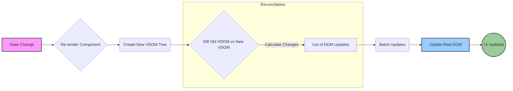

# Virtual DOM (VDOM)

## Introduction

The Virtual DOM (VDOM) is a programming concept where a virtual representation of a UI is kept in memory and synced with the "real" DOM by a library such as React. This process is called reconciliation.

The VDOM is essentially a lightweight JavaScript object that mirrors the structure of the real DOM. When the state of a React application changes, a new VDOM tree is created.

## Why VDOM?

Direct manipulation of the browser's DOM is computationally expensive and can lead to performance bottlenecks, especially in complex applications with frequent updates.

Benefits of using VDOM:
- **Performance:** React computes the difference (diffing) between the old VDOM tree and the new VDOM tree. It then updates only the changed parts in the real DOM, minimizing costly direct DOM operations.
- **Abstraction:** It allows developers to write declarative UI code (describing *what* the UI should look like for a given state) without worrying about the specific DOM manipulation steps.
- **Cross-Platform:** The VDOM concept enables React to render to different environments (like native mobile apps with React Native) because the core logic doesn't directly depend on the browser DOM API.

## How it Works

1.  **State Change:** An event (like user input or data fetching) triggers a state change in a component.
2.  **VDOM Creation:** React re-renders the component(s) affected by the state change, creating a new VDOM tree in memory.
3.  **Diffing:** React compares the new VDOM tree with the previous VDOM tree. This comparison process is efficient due to heuristic algorithms (see Diffing Algorithm topic).
4.  **Batching:** React batches multiple DOM updates together.
5.  **Real DOM Update:** React updates only the necessary parts of the real DOM based on the computed differences. This is the only point where the actual browser DOM is touched.

## Diagram: VDOM Update Process



## Simple Code Example

This example shows how a state change triggers a re-render, implicitly using the VDOM process.

```jsx
import React, { useState } from 'react';

function Counter() {
  const [count, setCount] = useState(0);

  const handleClick = () => {
    // 1. State Change
    setCount(count + 1);
    // React schedules a re-render
  };

  // 2. Re-render (Implicit VDOM Creation & Diffing)
  // When Counter re-renders, React creates a new VDOM node
  // representing the updated <p> element. It compares this
  // new VDOM node with the previous one. It finds that only
  // the text content inside the <p> has changed.
  console.log('Component Rendering...');

  return (
    <div>
      {/* 3. Real DOM Update (Optimized) */}
      {/* React updates only the text node within the existing <p> element */}
      {/* instead of recreating the entire div or p tag. */}
      <p>You clicked {count} times</p>
      <button onClick={handleClick}>Click me</button>
    </div>
  );
}

export default Counter;
```

Although we don't interact with the VDOM directly, understanding its role helps explain React's performance characteristics and declarative nature. 