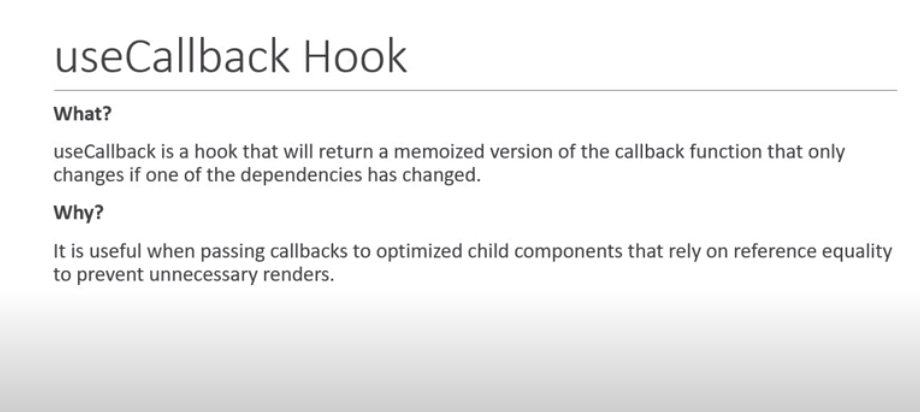

# useCallBack 

. it returns the memoized version of the callback function that only change if one of the dependecny changes 

. in our demo we can see that before prviding `memo` wrapper the count,title  they were rerendering even the relevent value was not getting changed 

. and to further improve the callback we are using useCallback since without it any one of the click both Button event Handler getting recreated 

``` jsx

const memoizedCallback = useCallback(
  () => {
    doSomething(a, b);
  },
  [a, b],
);

```


