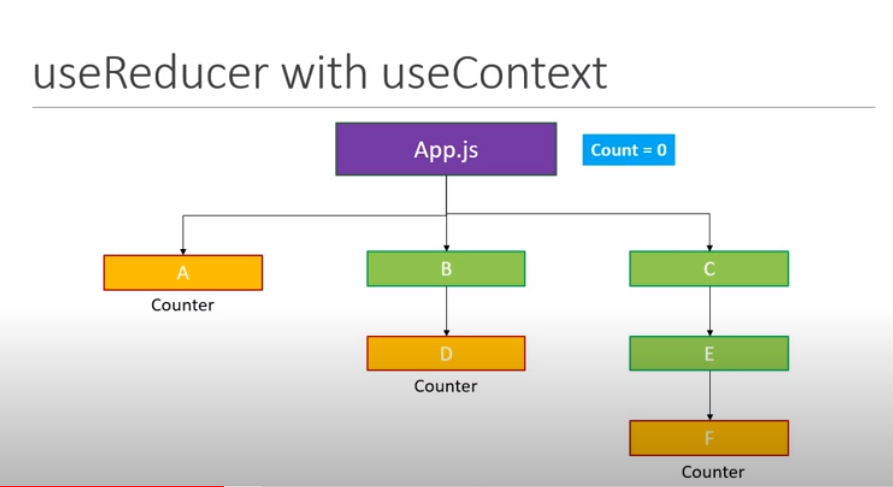

# useReducer

``` jsx
const [state, dispatch] = useReducer(reducer, initialArg, init);
```

1. useReducer is hook that is used for state management.

2. it is an alternative to useState 

3. useState is actually  built using useReducer 

4. An alternative to useState. Accepts a reducer of type `(state, action) => newState`, and returns the current state paired with a dispatch method. (If you’re familiar with Redux, you already know how this works.)

5. `useReducer is usually preferable to useState when you have complex state logic` that involves multiple sub-values or when the next state depends on the previous one. useReducer also lets you optimize performance for components that trigger deep updates because you can pass dispatch down instead of callbacks.

6. we can also use useReducer and useContext together to share the data and dispatching logic together refer the codeEvolution code and video 

 

# Lazy Initialstate initilization 

1. You can also create the initial state lazily. To do this, you can pass an init function as the third argument. `The initial state will be set to init(initialArg)`.

2. It lets you extract the logic for calculating the initial state outside the reducer. This is also handy for resetting the state later in response to an action:

