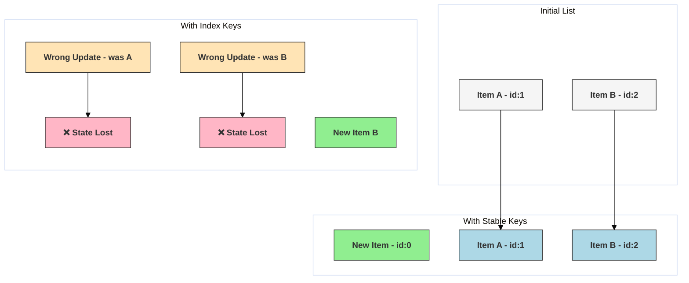

# Pitfall: Improper Keys in Lists

## Introduction

When rendering lists of elements in React (e.g., using `.map()`), you need to provide a special `key` prop to each list item. Keys help React identify which items have changed, been added, or been removed, allowing its diffing algorithm to work efficiently and correctly.

Using improper keys, especially using the array index as a key when the list can change order, add items to the beginning/middle, or be filtered, is a common pitfall that can lead to performance issues and subtle bugs related to component state and updates.

## The Purpose of Keys

Keys give each element in a list a stable identity across renders. React uses these keys during reconciliation:

1.  **Matching:** When comparing the old list with the new list, React uses the keys to match elements between the two lists.
2.  **Efficiency:** If keys match, React can reuse the existing component instance and DOM element, only updating its props or attributes if necessary.
3.  **Correctness:** If keys don't match or are missing, React might unnecessarily destroy and recreate component instances and DOM nodes, leading to performance degradation and loss of component state (like focus or input values).

## The Pitfall: Using Index as Key

It's tempting to use the array index as a key, especially since it's readily available during `.map()`:

```jsx
//  tempting but often problematic
items.map((item, index) => <li key={index}>{item.text}</li>);
```

**Why is this often bad?**

- **Unstable Identity:** The index of an item changes if items are added, removed, or reordered within the list. If you add an item to the beginning, every subsequent item gets a new index (and thus a new `key`).
- **Incorrect Diffing:** React matches elements based on the key. If the key (index) changes just because the item's position changed, React thinks it's a *different* element. It might update the existing component instance at that position with the props of the *new* item now at that index, rather than correctly moving or creating/destroying elements.
- **State Bugs:** If list items have their own state (e.g., an uncontrolled input, focus state), using the index as a key can cause state to be incorrectly associated with the wrong item after the list changes.

**When is index *okay*?**
Using the index as a key is only safe if **all** of the following conditions are met:
1.  The list and items are static – they are never reordered or filtered.
2.  The items have no IDs or other stable identifier.
3.  The list is never updated (items added/removed). OR updates only ever happen by adding items to the *end* of the list.

In practice, these conditions are rare for dynamic lists, making index keys generally unsafe.

## Consequences of Improper Keys

- **Performance Degradation:** React may perform unnecessary DOM manipulations (destroying/recreating nodes) instead of efficient updates or moves.
- **Loss of Component State:** State within list items (e.g., text typed into an `<input>`, checkbox status, focus) might be lost or incorrectly assigned to a different item.
- **Incorrect Animations/Transitions:** Visual glitches during insertions, deletions, or reorders.
- **Unexpected Behavior:** Subtle bugs that are hard to track down.

## Solution: Use Stable, Unique IDs

The best `key` is a string that uniquely and stably identifies an item among its siblings.

- **Ideal Source:** Use IDs from your data (like a database ID `item.id`).
- **Fallback:** If you don't have stable IDs, you might need to generate them (e.g., using a library like `uuid` when the item is created) or find some other combination of properties that uniquely identifies the item.
- **Keys only need to be unique among *siblings*,** not globally unique.

## Diagram: Diffing with Keys vs. Index


*Diagram shows: Stable keys allow reuse, index keys cause unnecessary updates and potential state issues when prepending.* 

## Code Example

```jsx
import React, { useState } from 'react';

let nextId = 3;

// Simple list item component (imagine it could have internal state)
function ListItem({ id, text }) {
  console.log(`Rendering ListItem: ${id} - ${text}`);
  // Imagine an input here: <input type="text" defaultValue={text} />
  // If keys are bad, typing in the input and then adding an item
  // at the start could cause the input value to jump to the wrong item.
  return <li>{text}</li>;
}

function KeyPitfallDemo() {
  const [items, setItems] = useState([
    { id: 1, text: 'Apple' },
    { id: 2, text: 'Banana' },
  ]);

  const addItemToStart = () => {
    const newItem = { id: nextId++, text: 'Cherry' };
    setItems([newItem, ...items]);
  };

  const addItemToEnd = () => {
    const newItem = { id: nextId++, text: 'Date' };
    setItems([...items, newItem]);
  };

  return (
    <div>
      <h2>Improper Keys Pitfall</h2>
      <button onClick={addItemToStart}>Add 'Cherry' to Start</button>
      <button onClick={addItemToEnd}>Add 'Date' to End</button>

      <h3>List with Index as Key (Potentially Bad)</h3>
      <ul>
        {items.map((item, index) => (
          // When adding to start, index 0 (was Apple) becomes Cherry.
          // React might try to update the existing component for Apple 
          // with Cherry's props, instead of inserting a new one.
          <ListItem key={index} id={item.id} text={item.text} />
        ))}
      </ul>

      <h3>List with Stable ID as Key (Good)</h3>
      <ul>
        {items.map((item) => (
          // When adding to start, React sees a new key (e.g., 3) and 
          // existing keys (1, 2). It correctly creates a new component 
          // for key 3 and reuses the components for keys 1 and 2.
          <ListItem key={item.id} id={item.id} text={item.text} />
        ))}
      </ul>
      <p>Check console logs when adding items, especially to the start.</p>
    </div>
  );
}

export default KeyPitfallDemo;
```

## Conclusion

Always provide stable and unique keys when rendering lists in React. Avoid using array indexes as keys unless the list is truly static and never changes order. Using proper keys is crucial for performance and preventing subtle state-related bugs during list updates. 