# Pitfall: Memory Leaks

## Introduction

Memory leaks in React applications occur when components allocate resources (like event listeners, timers, or subscriptions to external data sources) but fail to clean them up when the component is removed (unmounted) from the DOM. Over time, these lingering references can consume memory unnecessarily, potentially degrading performance or even crashing the application.

This is particularly relevant in Single Page Applications (SPAs) like those built with React, where the application runs for a long time without full page reloads, giving leaks more time to accumulate.

## Common Causes and Solutions

The primary cause of memory leaks in React components is setting up side effects that need explicit cleanup, and forgetting to perform that cleanup.

### 1. Unremoved Event Listeners

- **Cause:** Adding event listeners directly to `window`, `document`, or other DOM elements outside the component's own managed DOM, without removing them when the component unmounts.
- **Solution:** Use the cleanup function returned by `useEffect` to remove the event listener.

**Incorrect Code (Listener not removed):**
```jsx
import React, { useState, useEffect } from 'react';

function BadEventListenerLeak() {
  const [windowWidth, setWindowWidth] = useState(window.innerWidth);

  useEffect(() => {
    const handleResize = () => {
      console.log('Window resizing...');
      setWindowWidth(window.innerWidth);
    };
    // 🔴 Listener added but never removed
    window.addEventListener('resize', handleResize);
    console.log('Resize listener ADDED');

    // Missing cleanup function!
    // When this component unmounts, the listener stays attached to `window`,
    // keeping the `handleResize` function (and the component's closure) in memory.
  }, []);

  return <p>Window Width: {windowWidth}</p>;
}
```

**Corrected Code (Listener removal in cleanup):**
```jsx
import React, { useState, useEffect } from 'react';

function GoodEventListenerCleanup() {
  const [windowWidth, setWindowWidth] = useState(window.innerWidth);

  useEffect(() => {
    const handleResize = () => {
      console.log('Window resizing...');
      setWindowWidth(window.innerWidth);
    };
    window.addEventListener('resize', handleResize);
    console.log('Resize listener ADDED');

    // ✅ Cleanup function removes the listener on unmount
    return () => {
      window.removeEventListener('resize', handleResize);
      console.log('Resize listener REMOVED');
    };
  }, []); // Empty dependency array: runs once on mount, cleans up on unmount

  return <p>Window Width: {windowWidth}</p>;
}
```

### 2. Uncleared Timers (`setInterval`, `setTimeout`)

- **Cause:** Starting timers using `setInterval` or `setTimeout` but not clearing them using `clearInterval` or `clearTimeout` in the cleanup function.
- **Solution:** Store the timer ID returned by `setInterval`/`setTimeout` and call `clearInterval(id)`/`clearTimeout(id)` in the `useEffect` cleanup.

**Incorrect Code (Interval not cleared):**
```jsx
import React, { useState, useEffect } from 'react';

function BadTimerLeak() {
  const [time, setTime] = useState(0);

  useEffect(() => {
    console.log('Starting interval...');
    // 🔴 Interval started but never cleared
    const intervalId = setInterval(() => {
      console.log('Interval tick!'); // Keeps running even after unmount
      setTime(t => t + 1);
    }, 1000);

    // Missing cleanup function!
  }, []);

  return <p>Elapsed Time: {time}s (Timer might leak!)</p>;
}
```

**Corrected Code (Interval cleared in cleanup):**
```jsx
import React, { useState, useEffect } from 'react';

function GoodTimerCleanup() {
  const [time, setTime] = useState(0);

  useEffect(() => {
    console.log('Starting interval...');
    const intervalId = setInterval(() => {
      console.log('Interval tick!');
      setTime(t => t + 1);
    }, 1000);
    console.log('Interval ID:', intervalId);

    // ✅ Cleanup function clears the interval on unmount
    return () => {
      clearInterval(intervalId);
      console.log('Interval cleared:', intervalId);
    };
  }, []);

  return <p>Elapsed Time: {time}s</p>;
}
```

### 3. Unmanaged Subscriptions

- **Cause:** Subscribing to external data sources (like WebSockets, RxJS Observables, third-party libraries, or even manual pub/sub systems) without unsubscribing when the component unmounts.
- **Solution:** Use the `useEffect` cleanup function to call the appropriate unsubscribe method provided by the external source.

**Incorrect Code (Conceptual):**
```jsx
// Conceptual example assuming an external chat API
useEffect(() => {
  // 🔴 Subscribing without saving the unsubscribe method
  ChatAPI.subscribeToMessages(friendId, handleMessageReceived);
  console.log('Subscribed to messages');

  // Missing cleanup!
  // return () => ChatAPI.unsubscribeFromMessages(friendId, handleMessageReceived);
}, [friendId]);
```

**Corrected Code (Conceptual):**
```jsx
// Conceptual example assuming an external chat API
useEffect(() => {
  console.log('Subscribing to messages');
  // ✅ Subscribe and store the means to unsubscribe if needed
  // (Exact API depends on the source)
  const unsubscribe = ChatAPI.subscribeToMessages(friendId, handleMessageReceived);
  
  // ✅ Cleanup function unsubscribes
  return () => {
    unsubscribe();
    console.log('Unsubscribed from messages');
  };
}, [friendId]);
```

### 4. Pending Asynchronous Operations

- **Cause:** Initiating an asynchronous operation (like `fetch`) and then trying to update state (`setState`) in its callback after the component has already unmounted.
- **Solution:**
    - **AbortController:** Use `AbortController` to cancel fetch requests in the cleanup function.
    - **Cleanup Flag:** Set a flag (e.g., using `useRef`) in the cleanup function and check this flag before calling `setState` in the async callback.

**(See `useFetch` example in Custom Hooks topic for `AbortController` usage)**

## Identifying Memory Leaks

- **Browser DevTools (Memory Tab):** Tools like Chrome DevTools have a Memory tab where you can take heap snapshots before and after interacting with your application (e.g., mounting/unmounting components suspected of leaking). Comparing snapshots can reveal detached DOM nodes or objects that haven't been garbage collected.
- **Performance Monitoring:** Observe memory usage over time. Steadily increasing memory usage during prolonged use can indicate a leak.
- **Code Review:** Look specifically for `useEffect` hooks that set up listeners, timers, or subscriptions without a corresponding cleanup function.

## Diagram: Leak vs. Cleanup

```mermaid
%%{init: { 'theme': 'base', 'themeVariables': { 'fontSize': '14px', 'fontFamily': 'arial', 'textColor': '#333', 'clusterBkg': '#fff' } }}%%
graph TD
    subgraph Lifecycle["Component Lifecycle"]
        direction TB
        A["Component Mounts"] --> B{"useEffect Runs"}
        B -->|"Sets up"| C["Listener/Timer/Subscription"]
        D["User Navigates Away"] --> E{"Component Unmounts"}
    end

    subgraph NoCleanup["Without Cleanup"]
        direction TB
        F{"Cleanup Missing"} --> G["Listener/Timer Active"]
        G -->|"Retains"| H["Memory Leak 💧"]
    end

    subgraph WithCleanup["With Cleanup"]
        direction TB
        I["Cleanup Runs"] -->|"Removes"| J["Resources Freed"]
        J --> K["Garbage Collected ✅"]
    end

    E --> F
    E --> I

    %% Node styles
    classDef default font-family:arial,font-size:14px,font-weight:normal
    classDef process fill:#f5f5f5,stroke:#333,stroke-width:1px,color:#333,font-weight:bold
    classDef decision fill:#d4e6ff,stroke:#333,stroke-width:1px,color:#333,font-weight:bold
    classDef warning fill:#ffcccc,stroke:#333,stroke-width:1px,color:#333,font-weight:bold
    classDef success fill:#90EE90,stroke:#333,stroke-width:1px,color:#333,font-weight:bold

    %% Apply styles
    class A,D,C,I,J process
    class B,E,F decision
    class G,H warning
    class K success
```



## Conclusion

Memory leaks in React often stem from forgetting to clean up side effects initiated in `useEffect`. Always ensure that any listeners, timers, subscriptions, or pending operations established within an effect are properly torn down in its cleanup function. This is essential for maintaining application performance and stability, especially in long-running SPAs. 