# Pitfall: State Mutation

## Introduction

One of the core principles in React state management is **immutability**. This means you should never directly modify state variables (objects or arrays). Instead, you should always create *new* objects or arrays with the updated values and pass them to your state update function (`setState`, the setter from `useState`, or the return value from a `useReducer` dispatch).

Directly mutating state is a common pitfall that leads to unpredictable behavior, bugs that are hard to trace, and prevents React's optimization mechanisms (like `React.memo`, `PureComponent`, or dependency checks in `useEffect`/`useMemo`/`useCallback`) from working correctly.

## Why Immutability?

React relies on detecting changes in state and props to know when to re-render components. For objects and arrays, React primarily uses a **reference equality** check (`oldValue === newValue`).

- **If you mutate an object/array directly:** The reference to the object/array in memory remains the same. React compares the old reference with the (same) new reference, sees no change (`oldValue === newValue` is true), and incorrectly assumes nothing needs to be updated. This can cause your UI to not reflect the latest state.
- **If you create a new object/array:** The reference changes (`oldValue === newValue` is false). React correctly detects a change and proceeds with the re-rendering process.

Immutability ensures:
- **Change Detection:** React can reliably detect state changes.
- **Predictability:** State updates are explicit, making application flow easier to understand.
- **Performance Optimizations:** Enables optimizations like shallow comparison in `React.memo`, `PureComponent`, and Hooks, as they can safely rely on reference changes.
- **Time-Travel Debugging:** Tools like Redux DevTools rely on immutable state snapshots to allow stepping back through state changes.

## Common Mutation Mistakes and Solutions

### 1. Mutating State Objects

**Incorrect Code (Object Mutation):**
```jsx
import React, { useState } from 'react';

function BadObjectMutation() {
  const [user, setUser] = useState({ name: 'Alice', age: 30 });

  const handleAgeIncrement = () => {
    // 🔴 INCORRECT: Directly modifying the state object
    // user.age += 1; 
    // setUser(user); // React sees the same object reference, may not re-render!

    // Even if it re-renders sometimes, it breaks optimizations and predictability.
  };

  // Correct approach (shown in button for demonstration)
  const handleCorrectAgeIncrement = () => {
      // ✅ CORRECT: Create a *new* object with updated properties
      setUser(currentUser => ({ 
          ...currentUser, // Copy existing properties
          age: currentUser.age + 1 // Set the new value
      }));
  }

  return (
    <div>
      <p>Name: {user.name}</p>
      <p>Age: {user.age}</p>
      {/* <button onClick={handleAgeIncrement}>Increment Age (Mutating - Bad)</button> */}
      <button onClick={handleCorrectAgeIncrement}>Increment Age (Immutable - Good)</button>
    </div>
  );
}
```

**Solution:** Use the spread syntax (`...`) or methods like `Object.assign()` to create a *new* object with the desired changes.

### 2. Mutating State Arrays

**Incorrect Code (Array Mutation):**
```jsx
import React, { useState } from 'react';

let nextId = 3;

function BadArrayMutation() {
  const [items, setItems] = useState([{ id: 1, text: 'A' }, { id: 2, text: 'B' }]);

  const handleAddItem = () => {
    const newItem = { id: nextId++, text: 'C' };
    // 🔴 INCORRECT: Methods like push() mutate the original array
    // items.push(newItem); 
    // setItems(items); // React sees the same array reference, may not re-render!
  };

  // Correct approach
  const handleCorrectAddItem = () => {
      const newItem = { id: nextId++, text: 'C' };
      // ✅ CORRECT: Create a *new* array using spread syntax or concat()
      setItems(currentItems => [...currentItems, newItem]);
      // Alternative: setItems(currentItems => currentItems.concat(newItem));
  }
  
  // Similar pattern for removing/updating items (use filter, map):
  const handleRemoveItem = (idToRemove) => {
      setItems(currentItems => 
          currentItems.filter(item => item.id !== idToRemove) // filter returns a new array
      );
  }
  const handleUpdateItem = (idToUpdate, newText) => {
      setItems(currentItems => 
          currentItems.map(item => 
              item.id === idToUpdate ? { ...item, text: newText } : item // map returns a new array
          )
      );
  }

  return (
    <div>
      <ul>
        {items.map(item => <li key={item.id}>{item.text} (ID: {item.id})</li>)}
      </ul>
      {/* <button onClick={handleAddItem}>Add Item (Mutating - Bad)</button> */}
      <button onClick={handleCorrectAddItem}>Add Item (Immutable - Good)</button>
      <button onClick={() => handleRemoveItem(1)}>Remove Item 1</button>
      <button onClick={() => handleUpdateItem(2, 'Updated B')}>Update Item 2</button>
    </div>
  );
}
```

**Solution:** Use non-mutating array methods like `concat()`, `slice()`, `filter()`, `map()`, or the spread syntax (`...`) to create a *new* array with the changes.

## Diagram: Mutation vs. Immutability

```mermaid
%%{init: { 'theme': 'base', 'themeVariables': { 'fontSize': '14px', 'fontFamily': 'arial', 'textColor': '#333', 'clusterBkg': '#fff' } }}%%
graph TD
    subgraph MutationFlow["Direct Mutation (Incorrect)"]
        direction TB
        M1["Original State"] --> M2["Modify Directly"]
        M2 --> M3["Same Reference ⚠️"]
        M3 --> M4["React Misses Change ❌"]
    end

    subgraph ImmutableFlow["Immutable Update (Correct)"]
        direction TB
        I1["Original State"] --> I2["Create New Copy"]
        I2 --> I3["Modify Copy"]
        I3 --> I4["New Reference ✅"]
    end

    %% Node styles
    classDef default font-family:arial,font-size:14px,font-weight:normal
    classDef state fill:#f5f5f5,stroke:#333,stroke-width:1px,color:#333,font-weight:bold
    classDef warning fill:#ffcccc,stroke:#333,stroke-width:1px,color:#333,font-weight:bold
    classDef success fill:#90EE90,stroke:#333,stroke-width:1px,color:#333,font-weight:bold
    classDef action fill:#d4e6ff,stroke:#333,stroke-width:1px,color:#333,font-weight:bold

    %% Apply styles
    class M1,I1 state
    class M2,I2,I3 action
    class M3,M4 warning
    class I4 success
```



## Conclusion

Treating state as immutable is crucial in React. Always create new objects and arrays when updating state instead of modifying existing ones. This ensures React can accurately detect changes, prevents bugs, and allows performance optimizations to function correctly. Libraries like Immer can help simplify immutable updates for deeply nested state, but understanding the core principle is essential. 