# Pitfall: Too Many Renders / State Updates

## Introduction

React's rendering mechanism is generally efficient, but unnecessary re-renders can still become a performance bottleneck in complex applications. This pitfall occurs when components re-render more often than necessary, often due to frequent or improperly managed state updates.

While React 18 introduced Automatic Batching to help mitigate some cases, understanding the causes of excessive renders is crucial for optimization.

## Common Causes and Solutions

### 1. State Updates in the Render Body

- **Cause:** Calling a state setter function (like `setState` from `useState`) directly in the main body of a function component (or the `render` method of a class component).
- **Why it's bad:** The render function executes -> calls `setState` -> schedules *another* render -> the render function executes again -> calls `setState` again... -> **Infinite Loop**.
- **Solution:** State updates should only happen within event handlers (like `onClick`, `onChange`, `onSubmit`), `useEffect` hooks, or `useCallback`/`useMemo` (though updating state *within* memoization functions is an anti-pattern itself and should be avoided).

**Incorrect Code:**
```jsx
import React, { useState } from 'react';

function RenderLoop() {
  const [count, setCount] = useState(0);

  console.log('RenderLoop is rendering...');
  // 🔴 INCORRECT: Calling setState directly in the render body
  // This causes an infinite loop and errors.
  // setCount(count + 1); 

  return (
      <div>
          <p>This component would cause an infinite render loop if uncommented.</p>
          {/* Render count: {count} */}
      </div>
  );
}
```

**Corrected Code (Update in Event Handler):**
```jsx
import React, { useState } from 'react';

function CorrectUpdate() {
  const [count, setCount] = useState(0);

  console.log('CorrectUpdate is rendering...');

  // ✅ CORRECT: State update happens inside an event handler
  const handleClick = () => {
    setCount(count + 1);
  };

  return (
    <div>
      <p>Count: {count}</p>
      <button onClick={handleClick}>Increment</button>
    </div>
  );
}
```

### 2. Unnecessary Renders Due to Prop Changes (Reference Equality)

- **Cause:** Parent components pass down objects, arrays, or functions that are recreated on every parent render. Even if the *content* of the object/array/function is the same, the *reference* is new. Child components receiving these as props (especially those optimized with `React.memo` or `PureComponent`) will re-render because the prop reference changed.
- **Solution:**
    - **Memoize Props:** Use `useMemo` to memoize objects/arrays and `useCallback` to memoize functions in the parent component before passing them down.
    - **State Colocation:** Keep state as close as possible to where it's used to avoid passing props through many layers.
    - **Primitive Props:** Prefer passing primitive values (strings, numbers) if possible, as their equality check is simpler.

**Incorrect Code (New function on every render):**
```jsx
import React, { useState } from 'react';

const ChildComponent = React.memo(({ onAction, data }) => {
  console.log('Rendering ChildComponent...', data.id);
  return <button onClick={onAction}>Action for {data.id}</button>;
});

function ParentUnoptimized() {
  const [counter, setCounter] = useState(0); // State change forces parent re-render
  const someData = { id: 1 }; // Assume this object is stable or memoized

  // 🔴 INCORRECT: onChildAction is a new function on every render
  const onChildAction = () => {
    console.log('Child action triggered!');
  };

  return (
    <div>
      <button onClick={() => setCounter(c => c + 1)}>Re-render Parent ({counter})</button>
      {/* ChildComponent re-renders every time Parent renders due to new onAction function */}
      <ChildComponent onAction={onChildAction} data={someData} />
    </div>
  );
}
```

**Corrected Code (Using `useCallback`):**
```jsx
import React, { useState, useCallback, useMemo } from 'react';

const ChildComponentMemo = React.memo(({ onAction, data }) => {
  console.log('Rendering ChildComponentMemo...', data.id);
  return <button onClick={onAction}>Action for {data.id}</button>;
});

function ParentOptimized() {
  const [counter, setCounter] = useState(0);
  
  // ✅ CORRECT: useMemo ensures data object reference is stable
  const someData = useMemo(() => ({ id: 1 }), []); 

  // ✅ CORRECT: useCallback ensures function reference is stable
  const onChildAction = useCallback(() => {
    console.log('Child action triggered!');
  }, []); // Empty deps means function never changes

  return (
    <div>
      <button onClick={() => setCounter(c => c + 1)}>Re-render Parent ({counter})</button>
      {/* ChildComponentMemo only re-renders if its props actually change reference */}
      <ChildComponentMemo onAction={onChildAction} data={someData} />
    </div>
  );
}
```

### 3. Context Changes Triggering Unnecessary Renders

- **Cause:** A component consumes a context (`useContext`), but only uses a small part of the context value. If *any* part of the context value object changes (even parts the component doesn't use), the component will re-render.
- **Solution:**
    - **Split Contexts:** Divide large contexts into smaller, more granular contexts.
    - **Memoize Provider Value:** Ensure the `value` passed to the context provider is memoized (`useMemo`) if it's an object or array, so it doesn't change reference unnecessarily.
    - **Selectors (with Libraries):** State management libraries often provide selector mechanisms (`useStore(state => state.value)`) that automatically prevent re-renders if the selected slice of state hasn't changed.

**(See Observer Pattern topic for library examples)**

### 4. Frequent State Updates (Pre-React 18)

- **Cause:** Multiple `setState` calls occurring in quick succession within the same synchronous event handler (e.g., `onClick`) could trigger multiple separate re-renders in React versions before 18.
- **Solution (React 18+):** Automatic Batching. React 18 automatically batches multiple state updates that occur within a single event handler (or Promise, setTimeout, native event handler) into a single re-render. This largely solves this specific issue.
- **Solution (Pre-React 18):** Combine multiple state updates into one if possible, or use `ReactDOM.unstable_batchedUpdates()` (though relying on unstable APIs is generally discouraged).

## Identifying Unnecessary Renders

- **React DevTools Profiler:** The primary tool for diagnosing performance issues. It records renders, shows why components rendered (props changed, state changed, hook changed), and measures render duration.
- **`console.log()`:** Simple logging inside component bodies can quickly show how often they render.
- **Highlight Updates (DevTools Setting):** Visually highlights components on the screen as they re-render.

## Diagram: Unnecessary Render Cause (Unstable Prop)

```mermaid
%%{init: { 'theme': 'base', 'themeVariables': { 'fontSize': '14px', 'fontFamily': 'arial', 'textColor': '#333', 'clusterBkg': '#fff' } }}%%
graph TD
    subgraph RenderFlow["Render Flow"]
        direction TB
        A["Parent Renders"] --> B{"Creates New Prop"}
        B -->|"New Reference"| C["Child Component"]
        C --> D{"React.memo Check"}
        D -->|"Reference Changed"| E["Unnecessary Re-render ⚠️"]
    end

    %% Feedback loop
    E -->|"May Trigger"| A

    %% Node styles
    classDef default font-family:arial,font-size:14px,font-weight:normal
    classDef process fill:#f5f5f5,stroke:#333,stroke-width:1px,color:#333,font-weight:bold
    classDef decision fill:#fff3cd,stroke:#333,stroke-width:1px,color:#333,font-weight:bold
    classDef warning fill:#ffcccc,stroke:#333,stroke-width:1px,color:#333,font-weight:bold

    %% Apply styles
    class A,C process
    class B,D decision
    class E warning
```



## Conclusion

While React is fast by default, unnecessary renders can accumulate and impact performance. Key strategies to avoid this pitfall include: ensuring state updates occur only in handlers/effects, memoizing non-primitive props (`useMemo`, `useCallback`), optimizing context usage, and leveraging tools like the React DevTools Profiler to identify and fix performance bottlenecks. 