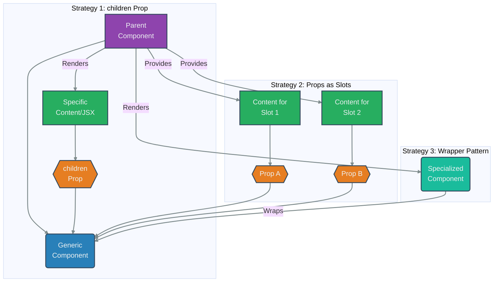

# Component Composition

## Introduction

Component composition is a fundamental concept in React, rooted in the idea of building complex UIs by combining smaller, independent, and reusable components. Instead of relying on inheritance (common in object-oriented UI frameworks), React heavily favors composition.

This means components are designed to be flexible containers, and their behavior and appearance are customized by passing other components (or data to render components) as props, most notably via the special `children` prop.

## Core Idea: Components as Functions/Building Blocks

Think of React components like JavaScript functions. They accept inputs (props) and return outputs (UI elements). Composition allows you to:
- Pass components as arguments (props) to other components.
- Use generic components (like `Card`, `Dialog`, `Sidebar`) that render specific content passed into them.
- Create specialized versions of components by wrapping them within other components.

## Using the `children` Prop

The most common way to achieve composition is through the `props.children` prop. Whatever JSX you put between the opening and closing tags of a component invocation is passed to that component as its `children` prop.

```jsx
import React from 'react';

// Generic Card component
function Card({ children, title }) {
  // Renders whatever is passed between its tags
  return (
    <div style={{ border: '1px solid grey', padding: '15px', margin: '10px', borderRadius: '5px' }}>
      {title && <h2>{title}</h2>} {/* Optional title */} 
      {children} {/* Render the content passed in */} 
    </div>
  );
}

// Specific content components
function UserProfile({ name, email }) {
  return (
    <div>
      <h4>{name}</h4>
      <p>{email}</p>
    </div>
  );
}

function ProductInfo({ name, price }) {
  return (
    <div>
      <h4>{name}</h4>
      <p>Price: ${price.toFixed(2)}</p>
    </div>
  );
}

// Using the Card component with different children
function App() {
  return (
    <div>
      <h1>Composition with `children`</h1>
      
      <Card title="User Card">
        {/* UserProfile is passed as children to Card */}
        <UserProfile name="Alice" email="alice@example.com" />
        <button>View Profile</button>
      </Card>
      
      <Card title="Product Card">
        {/* ProductInfo is passed as children to Card */}
        <ProductInfo name="Laptop" price={1200} />
        <button>Add to Cart</button>
      </Card>

      <Card>
        {/* Even simple text or other elements can be children */}
        <p>This is a simple card with just text content.</p>
      </Card>
    </div>
  );
}

export default App;
```

## Specialization via Props (Containment)

Sometimes, a component might need multiple distinct "holes" to be filled by parent components. Instead of relying solely on `children`, you can define specific props that accept JSX.

```jsx
import React from 'react';

// Generic Dialog component with specific props for content
function Dialog({ title, message, actions }) {
  return (
    <div style={{ border: '2px solid blue', background: '#eef', padding: '20px', margin: '10px' }}>
      <h2>{title}</h2> {/* Render title prop */} 
      <div>{message}</div> {/* Render message prop */} 
      <div style={{ marginTop: '15px' }}>{actions}</div> {/* Render actions prop */} 
    </div>
  );
}

// Using the Dialog by passing specific JSX to props
function AppSpecialization() {
  return (
    <div>
      <h1>Composition via Props</h1>
      <Dialog
        title="Confirm Action"
        message={<p>Are you sure you want to proceed?</p>}
        actions={
          <div>
            <button onClick={() => alert('Confirmed!')}>Confirm</button>
            <button onClick={() => alert('Cancelled!')} style={{ marginLeft: '10px' }}>Cancel</button>
          </div>
        }
      />

      <Dialog
        title="Welcome Message"
        message={<p>Welcome to our application! Enjoy your stay.</p>}
        actions={<button onClick={() => alert('OK!')}>OK</button>}
      />
    </div>
  );
}

// export default AppSpecialization; // Uncomment to run this example
```

## Specialization via Configuration (Wrapper Components)

Another way to achieve specialization is by creating a more specific component that wraps a more generic one, configuring it with specific props.

```jsx
import React from 'react';

// Assuming Dialog component from previous example exists

// Specializing Dialog for Welcome messages
function WelcomeDialog() {
  return (
    <Dialog 
      title="Welcome!"
      message={<p>Thanks for signing up!</p>}
      actions={<button onClick={() => alert('Get Started!')}>Get Started</button>}
    />
  );
}

// Specializing Dialog for Error messages
function ErrorDialog({ errorMessage }) {
  return (
    <Dialog 
      title="Error"
      message={<p style={{color: 'red'}}>Error: {errorMessage}</p>}
      actions={<button onClick={() => alert('Acknowledged')}>OK</button>}
    />
  );
}

function AppWrapperSpecialization() {
  return (
    <div>
      <h1>Composition via Wrapper Components</h1>
      <WelcomeDialog />
      <ErrorDialog errorMessage="Could not load data." />
    </div>
  );
}

// export default AppWrapperSpecialization; // Uncomment to run this example
```

## Diagram: Composition Strategies



# Composition vs Inheritance 
https://legacy.reactjs.org/docs/composition-vs-inheritance.html

## Conclusion

Composition is a powerful, flexible alternative to inheritance in React. By treating components as building blocks and passing them around via props (especially `children`), you can create highly reusable and maintainable UI structures. It encourages thinking in terms of "has-a" or "uses-a" relationships rather than "is-a" relationships. 