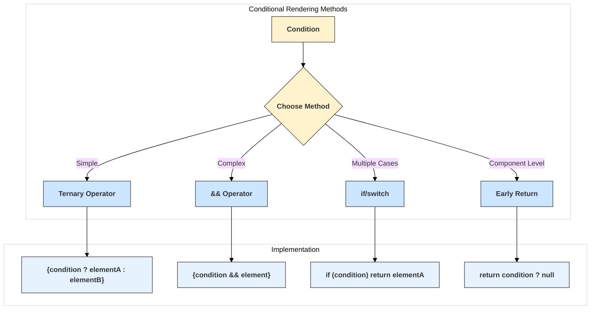

# Conditional Rendering Techniques

## Introduction

Conditional rendering in React allows you to render different UI elements or components based on certain conditions (like application state, user permissions, or props). React offers several straightforward ways to implement conditional logic directly within your JSX.

Since JSX is essentially JavaScript, you can use standard JavaScript operators and techniques like `if` statements, logical `&&` (AND), and the conditional (ternary) operator (`? :`).

## Common Techniques

1.  **`if`/`else` Statements:**
    - The most fundamental way, often used *outside* the JSX block to determine which component or element variable to render.
    - Cannot be used *directly inside* JSX curly braces `{}` because `if` is a statement, not an expression.

2.  **Logical `&&` Operator (Short-circuiting):**
    - Useful for rendering an element *only if* a condition is true.
    - Works because in JavaScript, `true && expression` always evaluates to `expression`, and `false && expression` always evaluates to `false` (which React ignores, rendering nothing).
    - Syntax: `{condition && <Element />}`

3.  **Conditional (Ternary) Operator (`condition ? exprIfTrue : exprIfFalse`):**
    - Ideal for choosing between two different elements or components based on a condition.
    - It's an expression, so it can be used directly inside JSX.
    - Syntax: `{condition ? <ElementIfTrue /> : <ElementIfFalse />}`

4.  **Immediately Invoked Function Expressions (IIFE):**
    - Allows using more complex logic (like `if/else if/else` or `switch`) directly within JSX by wrapping it in a function that's immediately called.
    - Can sometimes make the JSX less readable; often better to extract this logic into a separate function or component.
    - Syntax: 
      ```jsx
      {(() => {
        if (condition1) return <Element1 />;
        if (condition2) return <Element2 />;
        return <DefaultElement />;
      })()}
      ```

5.  **Enum-like Objects or Maps:**
    - Useful when you have multiple distinct states mapping to different UI outputs.
    - Define an object where keys represent states and values are the components/elements to render.
    - Syntax: `{statusMap[currentStatus]}`

6.  **Preventing Rendering with `null`:**
    - Returning `null` from a component's render method (or the component function itself) prevents it from rendering anything.
    - Useful for components that should sometimes be invisible.

## Diagram: Choosing a Technique



## Code Examples

```jsx
import React, { useState } from 'react';

function LoginButton({ onClick }) {
  return <button onClick={onClick}>Login</button>;
}

function LogoutButton({ onClick }) {
  return <button onClick={onClick}>Logout</button>;
}

function Greeting({ isLoggedIn }) {
  // Technique 1: Using if/else outside JSX
  if (isLoggedIn) {
    return <p>Welcome back!</p>;
  }
  return <p>Please sign in.</p>;
}

function Mailbox({ unreadMessages }) {
  const count = unreadMessages.length;
  return (
    <div>
      <h3>Mailbox</h3>
      {/* Technique 2: Logical && */}
      {count > 0 &&
        <p>You have {count} unread messages.</p>
      }
      {/* Technique 6: Returning null (implicit) */}
      {count === 0 &&
        <p>No new messages.</p> // Could also return null here
      }
    </div>
  );
}

function AuthControl() {
  const [isLoggedIn, setIsLoggedIn] = useState(false);

  const handleLoginClick = () => setIsLoggedIn(true);
  const handleLogoutClick = () => setIsLoggedIn(false);

  // Technique 3: Ternary Operator
  const button = isLoggedIn
    ? <LogoutButton onClick={handleLogoutClick} />
    : <LoginButton onClick={handleLoginClick} />;

  return (
    <div>
      <Greeting isLoggedIn={isLoggedIn} />
      {button}
    </div>
  );
}

function StatusIndicator({ status }) { // status: 'loading', 'success', 'error'
  // Technique 4: IIFE (can be less clean)
  // const indicator = (() => {
  //   if (status === 'loading') return <p>Loading...</p>;
  //   if (status === 'success') return <p>Success!</p>;
  //   if (status === 'error') return <p>Error!</p>;
  //   return null;
  // })();

  // Technique 5: Enum/Map Object (often cleaner for multiple states)
  const statusMap = {
    loading: <p>Loading...</p>,
    success: <p style={{ color: 'green' }}>Success!</p>,
    error: <p style={{ color: 'red' }}>Error!</p>,
  };

  return (
    <div>
      <h4>Status:</h4>
      {statusMap[status] || <p>Unknown status</p>} {/* Fallback for unknown status */}
    </div>
  );
}


function App() {
  const messages = ['React Mail', 'Angular Mail']; // Sample messages
  const [currentStatus, setCurrentStatus] = useState('loading');

  React.useEffect(() => { // Simulate status changes
    setTimeout(() => setCurrentStatus('success'), 2000);
    // setTimeout(() => setCurrentStatus('error'), 4000);
  }, []);

  return (
    <div>
      <h1>Conditional Rendering Demo</h1>
      <AuthControl />
      <hr />
      <Mailbox unreadMessages={messages} />
      <hr />
      <StatusIndicator status={currentStatus} />
    </div>
  );
}

export default App;

```

Choosing the right technique often depends on the complexity of the condition and personal/team preference for readability. 