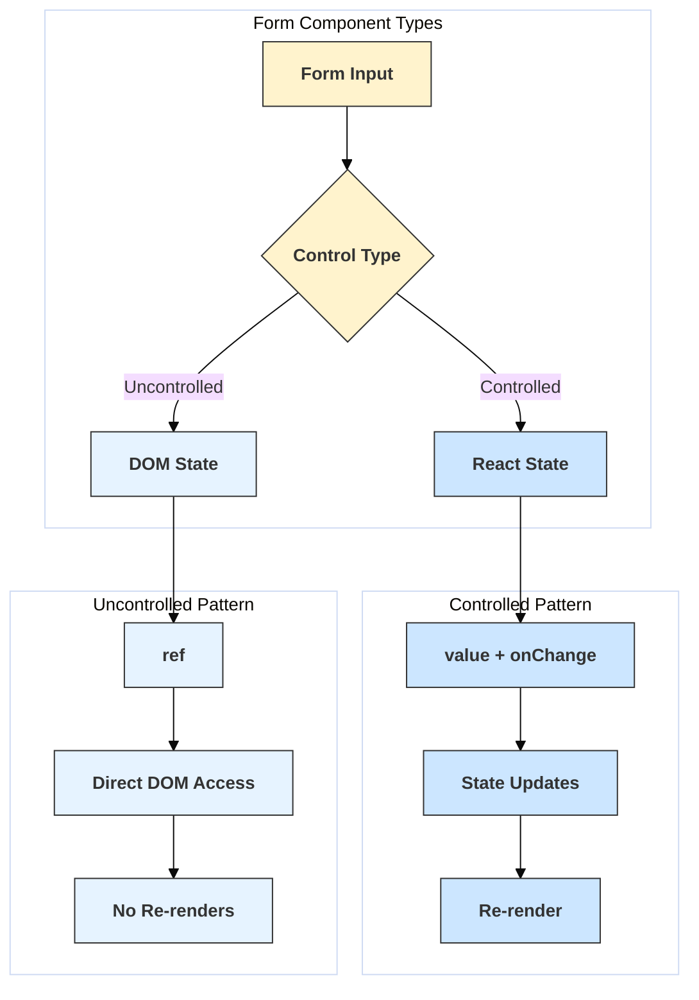

# Controlled vs Uncontrolled Components

## Introduction

In React, form elements like `<input>`, `<textarea>`, and `<select>` naturally maintain their own state within the DOM. When building forms in React, you have two primary approaches for handling the data associated with these form elements: Controlled Components and Uncontrolled Components.

- **Controlled Components:** The React component's state (managed via `useState` or `useReducer`) is the "single source of truth" for the input element's value. The React state dictates the value displayed in the form element.
- **Uncontrolled Components:** The form data is handled directly by the DOM itself. You typically use a `ref` to retrieve the value from the DOM when needed (e.g., upon form submission).

## Controlled Components

- **How it works:**
    1.  You add a state variable (e.g., using `useState`) to your component to hold the value of the input.
    2.  You set the `value` prop of the form element (e.g., `<input value={yourState}>`) to this state variable.
    3.  You provide an `onChange` handler to the form element. This handler updates the React state whenever the user types or interacts with the input.
- **Characteristics:**
    - The React state is the single source of truth.
    - Every keystroke or change triggers the `onChange` handler and potentially a re-render.
    - Allows for immediate input validation, formatting, or conditional disabling of buttons.
    - Easier to implement dynamic interactions based on input values.
    - Generally the recommended approach in React for most forms.

```jsx
import React, { useState } from 'react';

function ControlledForm() {
  // 1. State variable holds the input value
  const [name, setName] = useState('');
  const [email, setEmail] = useState('');
  const [errorMessage, setErrorMessage] = useState('');

  // 3. onChange handler updates the state
  const handleNameChange = (event) => {
    setName(event.target.value);
    // Immediate validation example
    if (event.target.value.length > 0 && event.target.value.length < 3) {
      setErrorMessage('Name must be at least 3 characters');
    } else {
      setErrorMessage('');
    }
  };
  
  const handleEmailChange = (event) => {
      setEmail(event.target.value);
  }

  const handleSubmit = (event) => {
    event.preventDefault(); // Prevent default browser submission
    if (name.length < 3) {
       setErrorMessage('Please fix errors before submitting.');
       return;
    } 
    console.log('Controlled Submit - Name:', name, 'Email:', email);
    // Proceed with form submission (e.g., API call)
  };

  return (
    <form onSubmit={handleSubmit}>
      <h3>Controlled Component Form</h3>
      <div>
        <label>Name: </label>
        <input 
          type="text" 
          // 2. value prop is tied to React state
          value={name} 
          onChange={handleNameChange} 
        />
      </div>
      <div>
        <label>Email: </label>
        <input 
          type="email" 
          value={email} 
          onChange={handleEmailChange} 
        />
      </div>
      {errorMessage && <p style={{ color: 'red' }}>{errorMessage}</p>}
      {/* Button can be disabled based on state */}
      <button type="submit" disabled={!!errorMessage || !name || !email}>Submit</button>
      <p>Current State -> Name: {name}, Email: {email}</p>
    </form>
  );
}

export default ControlledForm;
```

## Uncontrolled Components

- **How it works:**
    1.  You don't manage the input's value in React state.
    2.  You attach a `ref` (using `useRef`) to the form element.
    3.  When you need the value (typically in the form's `onSubmit` handler), you access it directly from the DOM node via `ref.current.value`.
    4.  You can use the `defaultValue` prop to set an initial value, but subsequent updates are handled by the DOM, not React.
- **Characteristics:**
    - The DOM is the source of truth for the input value.
    - Often simpler for basic forms where you only need the value on submission.
    - Can feel closer to traditional HTML forms.
    - Less React code is needed initially.
    - Harder to perform instant validation, formatting, or conditional logic based on the input value as it changes.
    - Integrating with some React patterns might be slightly more complex.
    - File inputs (`<input type="file">`) **must** be uncontrolled because their value is read-only.

```jsx
import React, { useRef } from 'react';

function UncontrolledForm() {
  // 1. Create refs for the input elements
  const nameInputRef = useRef(null);
  const emailInputRef = useRef(null);

  const handleSubmit = (event) => {
    event.preventDefault();
    // 3. Access values via ref.current.value on submit
    const name = nameInputRef.current.value;
    const email = emailInputRef.current.value;
    console.log('Uncontrolled Submit - Name:', name, 'Email:', email);
    // Validate and proceed with submission
    if (!name || !email) {
        alert('Please fill out all fields');
        return;
    }
    // ... submit data ...
    // Optionally clear form (imperatively)
    // nameInputRef.current.value = '';
    // emailInputRef.current.value = '';
  };

  return (
    <form onSubmit={handleSubmit}>
      <h3>Uncontrolled Component Form</h3>
      <div>
        <label>Name: </label>
        {/* 2. Attach ref, use defaultValue for initial value */}
        <input type="text" ref={nameInputRef} defaultValue="Initial Name" /> 
      </div>
      <div>
        <label>Email: </label>
        <input type="email" ref={emailInputRef} defaultValue="" />
      </div>
       {/* Validation/feedback is harder without state */}
      <button type="submit">Submit</button>
      <p>(Values read from DOM on submit)</p>
    </form>
  );
}

// export default UncontrolledForm; // Uncomment to run this example
```

## Diagram: Data Flow Comparison



## When to Use Which

- **Use Controlled Components when:**
    - You need to validate form input instantly.
    - You need to enforce a specific input format (e.g., masking).
    - You need to conditionally disable the submit button.
    - You have dynamic inputs where one input affects another.
    - You prefer keeping the state management within React consistently.
- **Use Uncontrolled Components when:**
    - You have a very simple form and only need the value on submission.
    - You are migrating legacy non-React code or integrating with libraries that rely on DOM manipulation.
    - You want less code for simple cases.
    - Dealing with file inputs.

In most modern React applications, **controlled components are the preferred and more common approach** due to the flexibility and easier integration with React's declarative state management. 