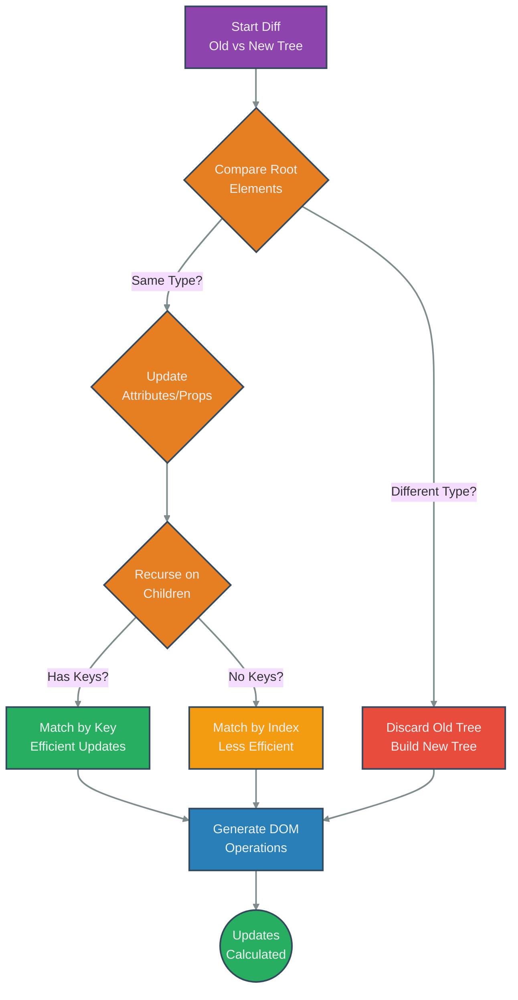

# React Diffing Algorithm

## Introduction

React uses a heuristic-based algorithm to compare two Virtual DOM trees (the previous tree and the new tree generated after a state/prop change) and determine the minimal set of operations needed to update the actual DOM. This process is a core part of reconciliation.

Finding the absolute minimal number of modifications between two arbitrary trees is computationally expensive (O(n^3) in complexity). React's diffing algorithm makes practical assumptions to achieve a much faster O(n) complexity.

## Key Heuristics

React's diffing algorithm relies on two main assumptions:

1.  **Different Element Types Produce Different Trees:**
    - If the root elements of the two compared subtrees have different types (e.g., `<div>` vs `<span>`, or `ComponentA` vs `ComponentB`), React assumes the entire old tree is invalid and needs replacement.
    - It tears down the old tree completely (unmounting components, removing DOM nodes) and builds the new tree from scratch (mounting new components, creating DOM nodes).
    - This avoids the complexity of trying to morph one type of component/element into another.

2.  **Stable Keys for Lists:**
    - When comparing a list of children (e.g., elements inside a `<ul>`), React iterates over both lists simultaneously and generates a mutation whenever there's a difference.
    - Without keys, React matches elements based on their index. This is inefficient for operations like prepending or reordering items, as it leads React to believe many items have changed when they only moved.
    - By providing stable, unique `key` props to elements in a list, you tell React how to identify the *same* element across renders, even if its position changes. React uses the keys to match children in the original tree with children in the subsequent tree, correctly identifying insertions, deletions, and reorders, leading to minimal DOM mutations.

## How it Works (Simplified)

- **Compare Root Elements:**
    - If types differ -> Destroy old tree, build new tree.
    - If types are the same (DOM element) -> Keep same underlying DOM node, update only changed attributes/styles.
    - If types are the same (Component) -> Update component instance (pass new props), re-render component, and recurse on its children.
- **Recurse on Children:**
    - After matching or updating the root node, React recurses on the children.
    - For lists, it uses the `key` attribute (if present) to efficiently match elements, minimizing updates.

## Diagram: Diffing Process Flow



## Code Example: Type Difference vs Attribute Update

```jsx
import React, { useState } from 'react';

function App() {
  const [useDiv, setUseDiv] = useState(true);
  const [className, setClassName] = useState('initial');

  const toggleElementType = () => {
    setUseDiv(!useDiv);
  };

  const changeClass = () => {
    setClassName(className === 'initial' ? 'updated' : 'initial');
  };

  // Check console logs to see component mounting/unmounting
  const Element = useDiv ? 'div' : 'span';

  return (
    <div>
      <button onClick={toggleElementType}>Toggle Element Type (div/span)</button>
      <button onClick={changeClass}>Change Class Name</button>

      {/* 
        1. Changing Element Type:
           When `useDiv` toggles, the root element type changes (`div` <-> `span`).
           React applies Heuristic #1: Tears down the old element and its children,
           creates a new one from scratch. Any state inside would be lost.
        2. Changing Class Name:
           When `className` changes, the root element type (`Element`) remains the same.
           React applies Heuristic #1 (same type): Keeps the underlying DOM node,
           updates only the `className` attribute. Much faster.
      */}
      <Element className={className}>
        This is the content inside.
        {/* Add a simple stateful component here to demonstrate state loss on type change */}
        <InnerComponent />
      </Element>
    </div>
  );
}

function InnerComponent() {
  React.useEffect(() => {
    console.log('InnerComponent Mounted');
    return () => console.log('InnerComponent Unmounted');
  }, []);
  return <p>Inner Content</p>;
}

export default App;
```

Run this example and observe the console logs. Toggling the element type causes `InnerComponent` to unmount and mount again, while changing the class name does not, demonstrating the impact of the first heuristic. 