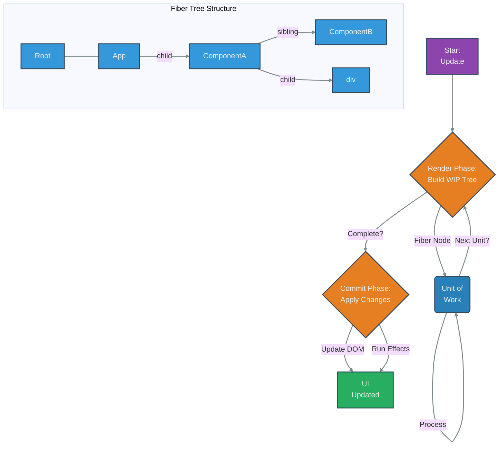

# React Fiber Architecture

## Introduction

React Fiber is a complete, backward-compatible rewrite of the old React reconciler (the core algorithm React uses to diff one tree with another to determine what needs to change). Introduced in React 16, its main goal was to enable incremental rendering: the ability to split rendering work into chunks and spread it out over multiple frames. This allows React to pause, abort, or reuse work as new updates come in, making the UI more responsive, especially for complex applications.

Key features enabled by Fiber include:
- Ability to pause, abort, or reuse work.
- Assigning priority to different types of updates.
- New concurrency features like `useTransition` and `useDeferredValue`.
- Improved error handling via Error Boundaries.

## How it Works

Instead of recursively processing the component tree and blocking the main thread (as the old "Stack" reconciler did), Fiber introduces "fiber" nodes. Each fiber node represents a unit of work and corresponds roughly to a component instance, DOM node, or other elements like Fragments or Portals.

These fibers form a linked list structure (parent, child, sibling pointers) which allows React to walk the tree iteratively and pause the work at any point without losing context.

The reconciliation process is split into two phases:

1.  **Render Phase (Interruptible):**
    - React builds the "work-in-progress" fiber tree based on the new updates.
    - It calls `render` methods (or function components) to determine changes.
    - This phase can be paused, aborted, or restarted by React. It produces no user-visible changes (like DOM updates) and should be pure.
2.  **Commit Phase (Not Interruptible):**
    - If the render phase completes successfully, React enters the commit phase.
    - It applies all the calculated changes to the actual DOM.
    - This phase runs synchronously and includes lifecycle methods like `componentDidMount`, `componentDidUpdate`, and effects (`useEffect`, `useLayoutEffect`).

## Diagram: Fiber Node Structure & Work Loop



## Conceptual Code Example

While Fiber is an internal implementation detail, its effects are visible through concurrency features. Here's a conceptual example (not direct Fiber API usage) showing how `startTransition` (enabled by Fiber) can keep the UI responsive during a heavy update.

```jsx
import React, { useState, useTransition } from 'react';

// Assume List is a component that renders a large number of items
// and can cause noticeable blocking when its props change.
function List({ items }) {
  return (
    <ul>
      {items.map(item => <li key={item}>{item}</li>)}
    </ul>
  );
}

function App() {
  const [isPending, startTransition] = useTransition();
  const [filter, setFilter] = useState('');
  const [items] = useState(() => Array.from({ length: 10000 }, (_, i) => `Item ${i + 1}`));

  const filteredItems = items.filter(item => item.includes(filter));

  function handleChange(e) {
    // Without transition, typing in the input might feel laggy
    // because filtering 10k items can block the main thread.
    // setFilter(e.target.value);

    // With transition, React keeps the input responsive (updating `filter` immediately)
    // and schedules the heavy list update (`filteredItems` re-calculation and re-render)
    // as a lower-priority, non-blocking transition.
    startTransition(() => {
      setFilter(e.target.value);
    });
  }

  return (
    <div>
      <input
        type="text"
        onChange={handleChange}
        placeholder="Filter items..."
      />
      {isPending ? <p>Loading list...</p> : null}
      <List items={filteredItems} />
    </div>
  );
}

export default App;
```

In this example, `startTransition` tells React that the state update inside it (`setFilter`) might trigger expensive rendering work, and it's okay to render intermediate states (like the "Loading list..." message) or even slightly delay the update to avoid blocking user input. This cooperative scheduling is a core benefit of the Fiber architecture. 