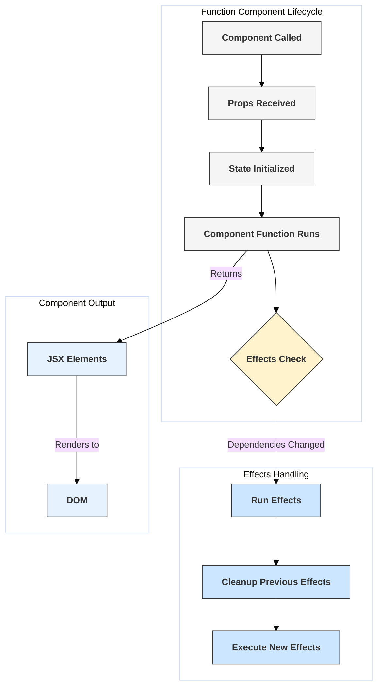

# Function Components

## Introduction

Function components are the primary way to define components in modern React development. They are simpler than class components, essentially being JavaScript functions that accept props as an argument and return React elements (typically JSX).

With the introduction of Hooks, function components can now manage state, perform side effects, access context, and utilize most features previously only available to class components, making them powerful and concise.

## Basic Structure

```javascript
// Simplest form: A function accepting props and returning JSX
function Welcome(props) {
  return <h1>Hello, {props.name}</h1>;
}

// Can also be defined using arrow functions (common practice)
const WelcomeArrow = (props) => {
  return <h1>Hello, {props.name}</h1>;
};

// Using destructuring for props (also very common)
const WelcomeDestructured = ({ name, message }) => {
  return (
    <div>
      <h1>Hello, {name}</h1>
      <p>{message}</p>
    </div>
  );
};
```

## Key Characteristics

- **Simplicity:** Less boilerplate code compared to class components (no `this`, no `render` method, no constructor usually needed).
- **Readability:** Easier to read and understand the relationship between props, state (via Hooks), and the rendered output.
- **Hooks:** Rely on Hooks (`useState`, `useEffect`, `useContext`, etc.) for state management and side effects.
- **No `this` keyword:** Function components don't have their own `this` context in the same way class components do. Values are captured directly from the function's scope.
- **Performance:** Historically, function components had slight performance advantages, though this is less significant now. The main benefit is often bundle size and ease of optimization.

## Using Hooks

Hooks allow function components to tap into React features:

```jsx
import React, { useState, useEffect } from 'react';

function Counter({ initialCount = 0 }) {
  // useState: Adds state to the component
  const [count, setCount] = useState(initialCount);

  // useEffect: Performs side effects after rendering
  useEffect(() => {
    // Update the document title whenever the count changes
    document.title = `You clicked ${count} times`;
    console.log(`Effect: Count is now ${count}`)

    // Optional cleanup function: Runs before the component unmounts
    // or before the effect runs again.
    return () => {
        console.log(`Cleanup: Previous count was ${count}`);
    }
  }, [count]); // Dependency array: Effect runs only if `count` changes

  const increment = () => {
    setCount(prevCount => prevCount + 1);
  };

  console.log('Rendering Counter component');

  return (
    <div>
      <p>You clicked {count} times</p>
      <button onClick={increment}>Click me</button>
    </div>
  );
}

export default Counter;

```

## Diagram: Function Component Lifecycle (Simplified with Hooks)


*Note: This is a simplified view. `useLayoutEffect` runs synchronously after DOM updates but before paint.* 

## When to Use

In modern React (version 16.8+), function components with Hooks are generally preferred for new development due to their simplicity and composability. Use them unless you specifically need features only available in class components (like Error Boundaries, though even those often wrap function components). 