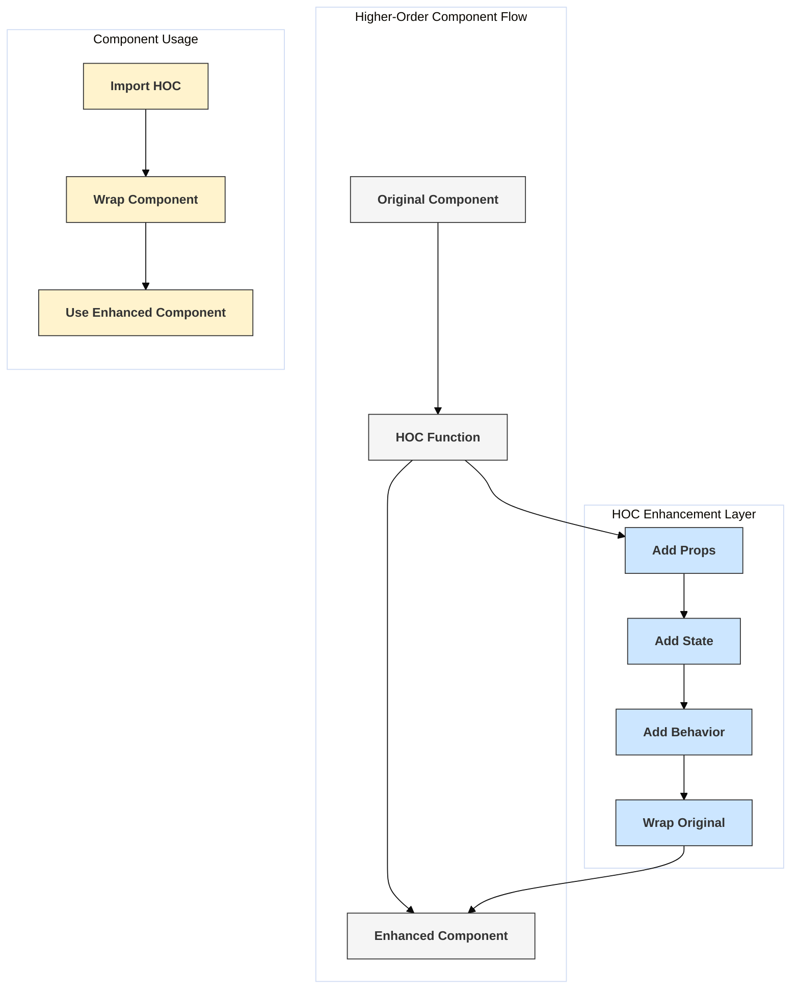

# Higher-Order Components (HOCs)

## Introduction

A Higher-Order Component (HOC) is an advanced technique in React for reusing component logic. HOCs are not part of the React API itself; they are a pattern that emerges from React's compositional nature.

Concretely, **a higher-order component is a function that takes a component as an argument and returns a new component.**

```javascript
const EnhancedComponent = higherOrderComponent(WrappedComponent);
```

This pattern allows you to abstract and reuse logic that involves observing a store, formatting data, providing props, managing subscriptions, or other concerns that can be decoupled from the core component logic.

## Purpose

HOCs are used to:
- **Share non-visual logic:** Inject common functionality (like data fetching, authentication checks, logging) into multiple components without repeating code.
- **Manipulate Props:** Add new props or modify existing ones before passing them to the wrapped component.
- **Abstract State:** Manage state or lifecycle logic externally and pass relevant data down as props.
- **Code Reusability:** Keep components focused on their primary task (often presentation) by wrapping them with HOCs that handle cross-cutting concerns.

## Implementation

Typically, an HOC is implemented as a function that:
1.  Accepts a `WrappedComponent` as its argument.
2.  Defines a new component (often a class or function component) inside.
3.  Inside the new component, it renders the `WrappedComponent`.
4.  It passes through the original `props` it received down to the `WrappedComponent` (`{...props}`).
5.  It can inject additional props or logic (e.g., fetch data and pass it as a prop, read from context, check authentication status).
6.  Returns the new component.

## Diagram: HOC Structure



## Code Example: `withLoading` HOC

This HOC displays a loading indicator while a specific prop (e.g., `isLoading`) is true.

```jsx
import React, { useState, useEffect } from 'react';

// 1. Define the HOC function
function withLoading(WrappedComponent, loadingPropName = 'isLoading') {
  // 2. Return a new component (can be class or function)
  return function ComponentWithLoading(props) {
    // 5. Access the prop that indicates loading state
    const isLoading = props[loadingPropName];
    
    if (isLoading) {
      return <p>Loading data...</p>;
    }

    // 3. Render the WrappedComponent
    // 4. Pass through original props
    return <WrappedComponent {...props} />;
  };
}

// --- Components to be wrapped ---

// A simple component displaying user data
function UserProfile({ user, someOtherProp }) {
  if (!user) return null;
  return (
    <div>
      <h3>{user.name}</h3>
      <p>Email: {user.email}</p>
      <p>Received other prop: {someOtherProp}</p>
    </div>
  );
}

// Another component displaying posts
function PostsList({ posts }) {
  if (!posts) return null;
  return (
    <ul>
      {posts.map(post => <li key={post.id}>{post.title}</li>)}
    </ul>
  );
}

// --- Apply the HOC --- 

const UserProfileWithLoading = withLoading(UserProfile, 'loadingUser'); // Use custom prop name
const PostsListWithLoading = withLoading(PostsList, 'loadingPosts'); // Use custom prop name

// --- Parent component using the enhanced components ---

function HOCDemo() {
  const [user, setUser] = useState(null);
  const [posts, setPosts] = useState(null);
  const [loadingUser, setLoadingUser] = useState(true);
  const [loadingPosts, setLoadingPosts] = useState(true);

  // Simulate data fetching
  useEffect(() => {
    setTimeout(() => {
      setUser({ id: 1, name: 'Alice', email: 'alice@example.com' });
      setLoadingUser(false);
    }, 1500);

    setTimeout(() => {
      setPosts([{ id: 101, title: 'React HOCs' }, { id: 102, title: 'React Hooks' }]);
      setLoadingPosts(false);
    }, 2500);
  }, []);

  return (
    <div>
      <h1>HOC Demo (withLoading)</h1>
      
      <h2>User Profile</h2>
      <UserProfileWithLoading 
        loadingUser={loadingUser} // Prop name matches HOC config
        user={user} 
        someOtherProp="Example Value" // Original props are passed through
      />
      
      <hr />
      
      <h2>Posts</h2>
      <PostsListWithLoading 
        loadingPosts={loadingPosts} // Prop name matches HOC config
        posts={posts} 
      />
    </div>
  );
}

export default HOCDemo;
```

## Conventions and Pitfalls

- **Pass Unrelated Props Through:** HOCs should pass through all props that they don't specifically consume (`{...props}`).
- **Maximize Composability:** HOCs should typically focus on a single concern.
- **Naming Convention:** Often prefixed with `with` (e.g., `withRouter`, `withAuth`).
- **Prop Name Collisions:** The HOC might inject a prop name already used by the wrapped component. Clear documentation or configurable prop names can help.
- **Static Methods:** The new container component returned by the HOC does not have the static methods (if any) of the original `WrappedComponent`. These need to be copied over manually or using a utility like `hoist-non-react-statics`.
- **Refs:** Refs are not passed through automatically. `React.forwardRef` is needed if the HOC needs to forward a ref to the wrapped component.
- **Debugging:** Can make debugging slightly harder due to the extra layer of component nesting. React DevTools help, but clear naming is important.

## Modern Alternatives

While still a valid pattern, HOCs have become less common for many use cases since the introduction of Hooks.
- **Custom Hooks:** Often provide a more direct and less verbose way to share stateful logic without extra component nesting.
- **Render Props:** Another pattern for sharing code, especially when the shared logic needs to render something itself.

Understanding HOCs is valuable for working with existing codebases (e.g., libraries like `react-redux`'s `connect` historically) and for appreciating different ways to achieve component composition in React. 