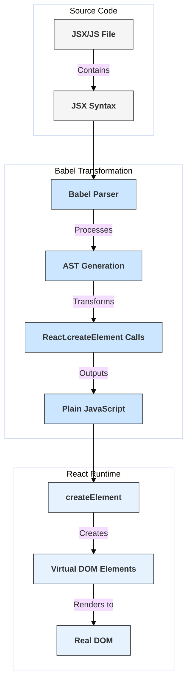

# JSX Syntax and Babel Transformation

## Introduction

JSX (JavaScript XML) is a syntax extension for JavaScript, commonly used with React to describe what the UI should look like. It resembles HTML but allows you to embed JavaScript expressions directly within the "markup".

JSX is *not* understood by browsers directly. It requires a compilation step, typically performed by a tool like Babel, to transform it into standard JavaScript function calls that browsers can execute.

## Syntactic Sugar

JSX provides a more concise and familiar syntax for creating React elements compared to using `React.createElement` directly.

For example, this JSX:
```jsx
const element = <h1 className="greeting">Hello, world!</h1>;
```

Is essentially syntactic sugar for this JavaScript call:
```javascript
const element = React.createElement(
  'h1',
  { className: 'greeting' },
  'Hello, world!'
);
```

Using JSX makes component code more readable and easier to visualize the UI structure.

## Babel Transformation

Babel is a JavaScript compiler that can convert modern JavaScript (including JSX) into backward-compatible versions for older browsers. When configured with the appropriate preset (like `@babel/preset-react`), Babel finds JSX syntax in your code and replaces it with `React.createElement` calls (or a different function if configured, like the new JSX transform in React 17+ which uses `jsx-runtime` imports).

**Key points about transformation:**
- **`React` must be in scope:** In older setups (before React 17's new JSX transform), because JSX compiled to `React.createElement`, the `React` library had to be imported into any file using JSX.
- **New JSX Transform (React 17+):** Modern setups often use a new transform where Babel automatically imports special functions (`jsx`, `jsxs`) from `react/jsx-runtime`, eliminating the need to manually import `React` just for JSX.
- **HTML Attributes vs DOM Properties:** JSX uses camelCase for most attributes that correspond to HTML attributes (e.g., `className` instead of `class`, `htmlFor` instead of `for`) because these become properties on JavaScript objects.
- **Embedding Expressions:** You can embed any valid JavaScript expression within JSX using curly braces `{}`.

## Diagram: JSX to JavaScript



## Code Examples

**1. Simple JSX Element:**

```jsx
// JSX
const title = <h1 id="main-title">Welcome to React!</h1>;

// Compiled JavaScript (conceptual, using React.createElement)
const titleCompiled = React.createElement(
  'h1',
  { id: 'main-title' },
  'Welcome to React!'
);
```

**2. JSX with Embedded Expressions and Children:**

```jsx
// JSX
const name = 'Alice';
const user = { avatarUrl: './avatar.png' };

const profile = (
  <div className="profile">
    <h2>{name}'s Profile</h2>
    
  </div>
);

// Compiled JavaScript (conceptual, using React.createElement)
const profileCompiled = React.createElement(
  'div',
  { className: 'profile' },
  React.createElement('h2', null, name + "'s Profile"),
  React.createElement('img', { src: user.avatarUrl, alt: name + "'s avatar" })
);

```

**3. JSX with Component:**

```jsx
// JSX
function Greeting({ name }) {
  return <p>Hello, {name}!</p>;
}

const app = <Greeting name="Bob" />;

// Compiled JavaScript (conceptual, using React.createElement)
/*
function Greeting({ name }) {
  return React.createElement('p', null, 'Hello, ', name, '!');
}

const appCompiled = React.createElement(Greeting, { name: 'Bob' });
*/
```

Understanding this transformation helps clarify why `React` needed to be in scope historically and how JSX integrates seamlessly with JavaScript logic. 