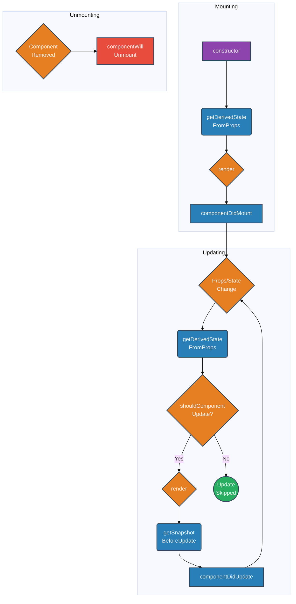

# Lifecycle Methods (Class Components)

## Introduction

Class components in React have a series of "lifecycle methods" that you can override to run code at particular times in the component's life. These methods allow you to control what happens when a component is created and added to the DOM (mounting), when it updates due to prop or state changes, and when it's removed from the DOM (unmounting).

While `useEffect` in function components covers the most common use cases of these methods, understanding the class lifecycle is essential for working with older codebases or Error Boundaries.

## Phases of Lifecycle

The lifecycle is typically divided into three main phases:

1.  **Mounting:** Putting elements into the DOM.
2.  **Updating:** Re-rendering the component due to changes in props or state.
3.  **Unmounting:** Removing the component from the DOM.

(There's also an Error Handling phase covered by Error Boundaries).

## Common Lifecycle Methods

Here are the most commonly used lifecycle methods in their typical order of execution:

### Mounting Phase

These methods are called in the following order when an instance of a component is being created and inserted into the DOM:

1.  **`constructor(props)`**
    - **Purpose:** Initialize state (`this.state = ...`), bind event handlers (`this.method = this.method.bind(this)`).
    - **Called:** Before the component is mounted.
    - **Notes:** Must call `super(props)` first. Avoid side effects or subscriptions here.

2.  **`static getDerivedStateFromProps(props, state)`**
    - **Purpose:** Allows a component to update its internal state based on changes in props *before* rendering. Used in rare cases where state depends directly on props over time.
    - **Called:** Right before calling `render()`, both on initial mount and subsequent updates.
    - **Notes:** Should return an object to update state, or `null` if no update is needed. It's static, so no access to `this`. Use sparingly as it can make components complex.

3.  **`render()`**
    - **Purpose:** To examine `this.props` and `this.state` and return React elements (JSX), arrays, fragments, strings, numbers, booleans, or null.
    - **Called:** During mounting and updating phases.
    - **Notes:** Must be a *pure function* of props and state. No side effects (e.g., `setState`, DOM manipulation, network requests) allowed here.

4.  **`componentDidMount()`**
    - **Purpose:** Ideal place for side effects like network requests, DOM manipulation (that needs the node to exist), setting up subscriptions.
    - **Called:** Immediately after the component is mounted (inserted into the DOM tree).
    - **Notes:** Calling `setState` here *is* allowed and will trigger an extra render, but it will happen before the browser updates the screen. Useful for things like measuring DOM nodes.

### Updating Phase

An update can be caused by changes to props or state. These methods are called in the following order when a component is being re-rendered:

1.  **`static getDerivedStateFromProps(props, state)`** (Called first, see Mounting Phase)

2.  **`shouldComponentUpdate(nextProps, nextState)`**
    - **Purpose:** Performance optimization. Lets React know if a component's output is not affected by the current change in state or props, allowing React to skip the `render()` and potentially the entire update phase.
    - **Called:** Before rendering when new props or state are being received.
    - **Notes:** Defaults to returning `true`. If you implement it, return `false` to skip the update. Compares `nextProps` with `this.props` and `nextState` with `this.state`. `React.PureComponent` implements this with a shallow comparison.

3.  **`render()`** (Called if `shouldComponentUpdate` returns `true`)

4.  **`getSnapshotBeforeUpdate(prevProps, prevState)`**
    - **Purpose:** Called right before the changes from the render phase are committed to the DOM. Enables your component to capture some information from the DOM (e.g., scroll position) before it's potentially changed.
    - **Called:** Right before the `render()` output is committed to the DOM.
    - **Notes:** The value returned by this method will be passed as the third parameter (`snapshot`) to `componentDidUpdate()`. Rarely needed, but useful for cases like preserving scroll position in a chat window.

5.  **`componentDidUpdate(prevProps, prevState, snapshot)`**
    - **Purpose:** Ideal place for side effects after an update occurs (e.g., network requests based on prop changes).
    - **Called:** Immediately after updating occurs. Not called for the initial render.
    - **Notes:** You can call `setState` here, but wrap it in a condition (e.g., checking if props changed: `if (this.props.userID !== prevProps.userID)`) to avoid infinite loops.

### Unmounting Phase

This method is called when a component is being removed from the DOM:

1.  **`componentWillUnmount()`**
    - **Purpose:** Perform cleanup actions: invalidating timers, canceling network requests, removing event listeners, cleaning up subscriptions created in `componentDidMount()`.
    - **Called:** Immediately before a component is unmounted and destroyed.
    - **Notes:** Do *not* call `setState` here, as the component will never re-render.

### Error Handling Phase

These methods are called when there is an error during rendering, in a lifecycle method, or in the constructor of any child component. (See Error Boundaries topic).

1.  **`static getDerivedStateFromError(error)`**
2.  **`componentDidCatch(error, info)`**

## Diagram: Common Lifecycle Flow

## Deprecated/Legacy Methods

Some older lifecycle methods (`componentWillMount`, `componentWillReceiveProps`, `componentWillUpdate`) are considered legacy and should be avoided in new code. They have safer alternatives or are covered by the methods listed above.

Understanding these methods provides insight into how class components manage state and side effects over time. 