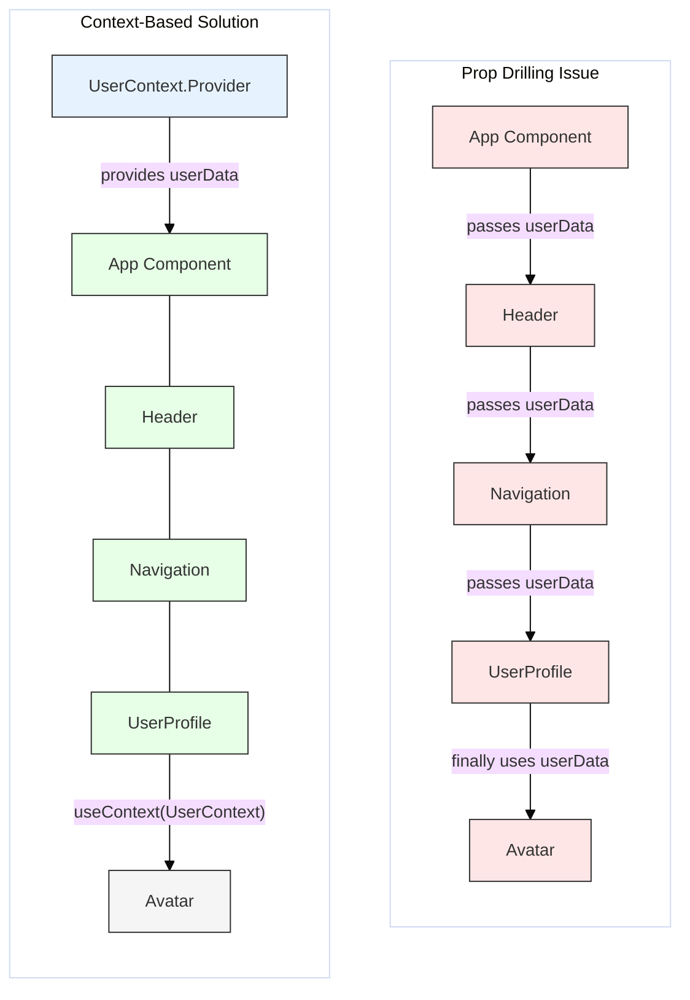

# Optimization: Avoiding Prop Drilling

## Introduction

Prop drilling refers to the process of passing data down through multiple layers of nested components, even if some intermediate components don't actually need the data themselves but only serve to pass it along to their children.

While passing props is fundamental to React, excessive prop drilling (passing props through many levels, e.g., 5+ levels deep) can lead to several problems:

- **Code Verbosity:** Components become cluttered with props they don't use.
- **Maintainability Issues:** Refactoring becomes difficult. If the data shape changes or a prop needs to be added/removed, you might have to modify many intermediate components.
- **Reduced Reusability:** Intermediate components become coupled to the props they pass through, making them harder to reuse in different contexts.
- **Potential Performance Issues:** Although less common, passing down new object/function references unnecessarily through many layers can contribute to unwanted re-renders if not managed carefully.

## The Problem Illustrated

Imagine a component tree where the top-level `App` has some user data that a deeply nested `UserProfileAvatar` component needs:

```
App (has user data)
  |_ Layout
     |_ Sidebar
        |_ UserProfile (Needs user data)
           |_ UserProfileAvatar (Needs user data)
```

Without a better solution, the `user` prop would have to be passed from `App` -> `Layout` -> `Sidebar` -> `UserProfile` -> `UserProfileAvatar`. `Layout` and `Sidebar` don't actually use the `user` data.

## Solutions to Avoid Prop Drilling

React and its ecosystem offer several ways to avoid prop drilling:

1.  **Component Composition:**
    - **How:** Instead of passing data down, pass the component that *needs* the data directly as a prop (often `children`) to a more generic intermediate component.
    - **When:** Useful when intermediate components act as generic containers (like `Card`, `Panel`, `Layout`) and don't need the specific data themselves.
    - **Example:** `Layout` could receive `Sidebar` as a prop, and `Sidebar` could receive `UserProfile` as a prop, with `App` composing them together with the necessary data closer to where it's needed.

2.  **React Context API:**
    - **How:** Create a Context Provider near the top of the tree (where the data lives) and allow any component deep in the tree to consume that data directly using `useContext`.
    - **When:** Ideal for global state or data that many components at different nesting levels need access to (e.g., theme, user authentication status, language preference).
    - **Example:** Wrap the `App` or `Layout` in a `UserContext.Provider` and have `UserProfileAvatar` use `useContext(UserContext)`.

3.  **State Management Libraries (Redux, Zustand, Jotai, Recoil, etc.):**
    - **How:** These libraries provide centralized stores for application state. Components can connect directly to the store to read state and dispatch actions, bypassing intermediate components entirely.
    - **When:** Suitable for managing complex, application-wide state, especially when updates can come from various parts of the app.
    - **Example:** `App` might dispatch an action to set the user in a Redux store, and `UserProfileAvatar` could use a selector (like `useSelector` in `react-redux`) to read the user data directly from the store.

4.  **Render Props / Custom Hooks (with Context):**
    - **How:** While less common solely for prop drilling since Context/Hooks, render props or custom hooks combined with context can encapsulate state logic and provide data directly to consumers.
    - **When:** Can be used for sharing specific stateful logic and data without a global store.

## Diagram: Prop Drilling vs. Context



## Code Example: Prop Drilling vs. Context API

**1. Prop Drilling Example:**

```jsx
import React from 'react';

// Deeply nested component that needs the data
function Grandchild({ message }) {
  console.log('Rendering Grandchild...');
  return <p>Grandchild received: {message}</p>;
}

// Intermediate component that just passes the prop
function Child({ message }) {
  console.log('Rendering Child (passing prop)...');
  return (
    <div style={{ border: '1px solid green', padding: '10px' }}>
      <h4>Child Component</h4>
      <Grandchild message={message} />
    </div>
  );
}

// Top-level component holding the state
function PropDrillingApp() {
  const message = "Hello from the top!";
  console.log('Rendering PropDrillingApp...');
  
  return (
    <div style={{ border: '1px solid red', padding: '10px' }}>
      <h2>Prop Drilling Example</h2>
      {/* Message is passed through Child */}
      <Child message={message} />
    </div>
  );
}

// export default PropDrillingApp;
```

**2. Context API Solution:**

```jsx
import React, { useState, useContext, createContext } from 'react';

// 1. Create Context
const MessageContext = createContext('default message');

// Deeply nested component consumes context directly
function GrandchildWithContext() {
  // 4. Consume context
  const message = useContext(MessageContext);
  console.log('Rendering GrandchildWithContext...');
  return <p>Grandchild (Context) received: {message}</p>;
}

// Intermediate component does NOT need the prop anymore
function ChildNoDrill() {
  console.log('Rendering ChildNoDrill (no props needed)...');
  return (
    <div style={{ border: '1px solid green', padding: '10px' }}>
      <h4>Child Component</h4>
      <GrandchildWithContext />
    </div>
  );
}

// Top-level component provides the context
function ContextSolutionApp() {
  const message = "Hello via Context!";
  console.log('Rendering ContextSolutionApp...');
  
  return (
    // 2. Provide Context
    <MessageContext.Provider value={message}>
      <div style={{ border: '1px solid blue', padding: '10px' }}>
        <h2>Context API Solution Example</h2>
        {/* Child doesn't need message prop */} 
        <ChildNoDrill /> 
      </div>
    </MessageContext.Provider>
  );
}

export default ContextSolutionApp;
```

## Conclusion

Prop drilling makes components less maintainable and reusable. While acceptable for shallow component trees, for deeper trees or widely needed data, prefer solutions like **Component Composition**, **React Context**, or dedicated **State Management Libraries** to provide data more directly to the components that need it. 