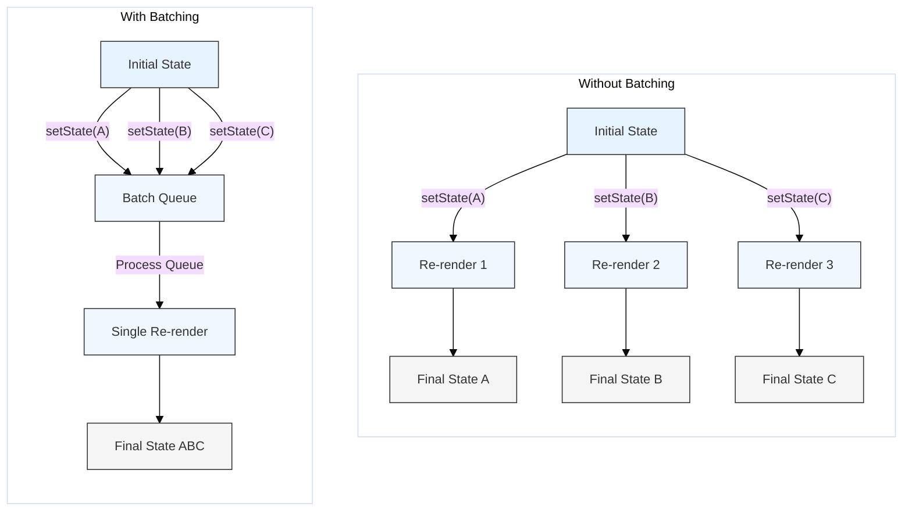

# Optimization: Batched Updates

## Introduction

State update batching is a performance optimization technique in React where multiple state updates triggered within a short period are grouped together into a single re-render cycle. This prevents components from re-rendering multiple times for closely related state changes, improving performance and efficiency.

Historically, React's batching behavior was limited, but **React 18 introduced Automatic Batching**, significantly expanding where batching occurs by default.

## The Problem Without Batching

Imagine you have an event handler that needs to update two pieces of state:

```javascript
function handleClick() {
  setCounter(c => c + 1);
  setIsActive(false);
}
```

Without batching, each `set...` call could potentially trigger a separate re-render of the component. For two state updates, this would mean: Render -> Update `counter` -> Re-render -> Update `isActive` -> Re-render. This is inefficient, especially if the component is complex.

## React's Batching Behavior

### Before React 18

- React **only** batched state updates that occurred within **React event handlers** (like `onClick`, `onChange`, etc.) and lifecycle methods.
- State updates inside Promises, `setTimeout`, `setInterval` callbacks, or native event listeners were **not** batched by default. Each `setState` call in these contexts would trigger its own re-render.

### React 18 and Beyond: Automatic Batching

- React 18 introduced **Automatic Batching**, powered by the new concurrent renderer.
- Now, React automatically batches **all** state updates by default, regardless of where they originate from:
    - React event handlers (as before)
    - Promises (`.then()`, `.catch()`, `.finally()`)
    - `setTimeout` and `setInterval` callbacks
    - Native event listeners (e.g., `window.addEventListener`)
- This means that multiple state updates triggered within any of these contexts will typically result in only a **single re-render**.

## Diagram: Batching Comparison



## Code Example (Illustrating React 18 Behavior)

This example demonstrates how multiple state updates inside a `setTimeout` (which would *not* be batched pre-React 18) are automatically batched in React 18+.

```jsx
import React, { useState } from 'react';

function BatchingDemo() {
  const [count, setCount] = useState(0);
  const [isActive, setIsActive] = useState(true);

  console.log('Rendering BatchingDemo...');

  const handleClick = () => {
    console.log('--- Click Handler Start ---');
    // These two updates inside a React event handler were always batched.
    setCount(c => c + 1);
    console.log('setCount called');
    setIsActive(a => !a);
    console.log('setIsActive called');
    console.log('--- Click Handler End (Expect 1 render) ---');
    // In React 18+, this typically results in one re-render.
  };

  const handleAsyncClick = () => {
    console.log('--- Async Click Handler Start ---');
    setTimeout(() => {
      console.log('--- setTimeout Callback Start ---');
      // In React 18+, these are AUTOMATICALLY BATCHED.
      // Before React 18, each would cause a separate re-render.
      setCount(c => c + 1);
      console.log('Async setCount called');
      setIsActive(a => !a);
      console.log('Async setIsActive called');
      console.log('--- setTimeout Callback End (Expect 1 render in React 18+) ---');
    }, 50); // Delay slightly
  };

  return (
    <div>
      <h2>Automatic Batching Demo (React 18+)</h2>
      <p>Count: {count}</p>
      <p>Active: {isActive ? 'Yes' : 'No'}</p>
      <button onClick={handleClick}>Update State (Handler)</button>
      <button onClick={handleAsyncClick}>Update State (Async - setTimeout)</button>
      <p>Check console logs. Notice renders after each button click.</p>
      <p>In React 18+, both buttons should ideally result in only one render per click.</p>
    </div>
  );
}

export default BatchingDemo;
```

## Opting Out (Rarely Needed)

If you need to force React to process a state update and re-render *immediately* without batching (a very rare use case, perhaps for fine-grained control when integrating with non-React systems), you can use `ReactDOM.flushSync()`:

```javascript
import { flushSync } from 'react-dom';

function handleClick() {
  flushSync(() => {
    setCounter(c => c + 1); 
  });
  // React has flushed the update and re-rendered synchronously *before* this line.
  
  flushSync(() => {
    setIsActive(false);
  });
  // React has flushed the second update synchronously.
}
```

**Use `flushSync` sparingly, as it can hurt performance by opting out of batching.**

## Conclusion

Automatic Batching in React 18+ is a significant performance improvement that simplifies state updates by grouping multiple changes into single re-renders by default across various contexts (handlers, Promises, timeouts). Understanding this behavior helps explain React's rendering performance and removes the need for manual batching workarounds in most cases. 