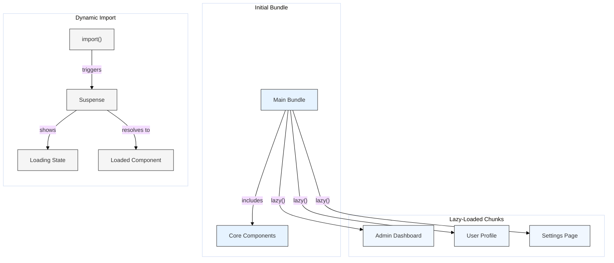

# Optimization: Code Splitting

## Introduction

Code splitting is a technique used by modern JavaScript bundlers (like Webpack, Rollup, Parcel, Vite) to split your application's code into smaller chunks that can be loaded on demand, rather than bundling everything into a single, monolithic file.

This is a key strategy for improving the initial load performance of web applications, especially large ones. By loading only the code needed for the initial route or view, users experience faster startup times.

`React.lazy()` and dynamic `import()` are the primary mechanisms within your React code to *enable* code splitting at the component level, but code splitting itself is fundamentally a **bundler feature**.

## Why Code Splitting?

- **Faster Initial Load:** Users download significantly less JavaScript when they first visit the site, leading to quicker rendering and interactivity (improved TTI/FCP).
- **On-Demand Loading:** Code for specific features, routes, or components is only fetched when it's actually required.
- **Better Caching:** Smaller, separate chunks can be cached more effectively by the browser. If only one chunk changes, users only need to download that specific chunk again, not the entire application bundle.
- **Parallel Loading:** Browsers can potentially download multiple small chunks in parallel.

## How it Works (with Bundlers)

1.  **Dynamic `import()` Syntax:** You use the dynamic `import('./module')` syntax in your code (often within `React.lazy`). This signals to the bundler that the specified module should be treated as a separate "split point".
2.  **Bundler Analysis:** During the build process, the bundler (e.g., Webpack) analyzes these dynamic imports.
3.  **Chunk Creation:** For each dynamic import encountered, the bundler creates a separate JavaScript file (a "chunk") containing the code for that module and its dependencies (that aren't already in other chunks, like the main bundle).
4.  **Loading Mechanism:** The bundler also ensures that the necessary runtime code is included in your main bundle to handle loading these chunks asynchronously when the dynamic `import()` call is executed in the browser.

## Common Code Splitting Strategies

1.  **Route-Based Splitting:**
    - **Description:** The most common and often most impactful strategy. Split your code based on application routes. Each page or major section of your application becomes a separate chunk.
    - **Implementation:** Use `React.lazy()` to import page-level components within your router configuration (e.g., React Router).

    ```jsx
    import React, { Suspense, lazy } from 'react';
    import { BrowserRouter as Router, Routes, Route, Link } from 'react-router-dom';

    // Lazy load page components
    const HomePage = lazy(() => import('./pages/HomePage'));
    const AboutPage = lazy(() => import('./pages/AboutPage'));
    const ProfilePage = lazy(() => import('./pages/ProfilePage'));

    function AppRouter() {
      return (
        <Router>
          <nav>
            <Link to="/">Home</Link> | 
            <Link to="/about">About</Link> | 
            <Link to="/profile">Profile</Link>
          </nav>
          <Suspense fallback={<p>Loading page...</p>}>
            <Routes>
              <Route path="/about" element={<AboutPage />} />
              <Route path="/profile" element={<ProfilePage />} />
              <Route path="/" element={<HomePage />} />
            </Routes>
          </Suspense>
        </Router>
      );
    }
    
    export default AppRouter;
    ```

2.  **Component-Based Splitting:**
    - **Description:** Split out large individual components that are not always needed immediately (e.g., modals, complex widgets, components below the fold).
    - **Implementation:** Use `React.lazy()` directly where you conditionally render the component.

    ```jsx
    import React, { useState, Suspense, lazy } from 'react';

    const HeavyChartComponent = lazy(() => import('./components/HeavyChartComponent'));

    function Dashboard() {
      const [showChart, setShowChart] = useState(false);

      return (
        <div>
          <h1>Dashboard</h1>
          <button onClick={() => setShowChart(true)}>Show Heavy Chart</button>
          {showChart && (
            <Suspense fallback={<p>Loading chart data...</p>}>
              <HeavyChartComponent />
            </Suspense>
          )}
        </div>
      );
    }
    ```

## Diagram: Bundling Comparison



## Bundler Configuration (Conceptual)

While `React.lazy` signals *where* to split, configuring *how* chunks are created (naming, size limits, shared dependencies) is done in your bundler's configuration file (e.g., `webpack.config.js`, `vite.config.js`). Modern tools like Create React App, Next.js, Remix, and Vite often handle sensible default configurations for code splitting.

Example concepts in Webpack:
- **`output.filename` / `output.chunkFilename`:** Controls naming patterns for entry and non-entry chunks.
- **`optimization.splitChunks`:** Powerful configuration object to control how shared modules (like vendor libraries from `node_modules`) are extracted into common chunks to avoid duplication.
- **Magic Comments:** Using comments like `import(/* webpackChunkName: "my-chunk-name" */ './module')` can provide hints to Webpack for chunk naming.

## Conclusion

Code splitting, primarily enabled in React via `React.lazy` and dynamic `import()`, is a vital optimization strategy handled by your module bundler. By breaking down large applications into smaller, on-demand chunks (especially route-based), you can significantly improve initial load times and provide a much better user experience. 