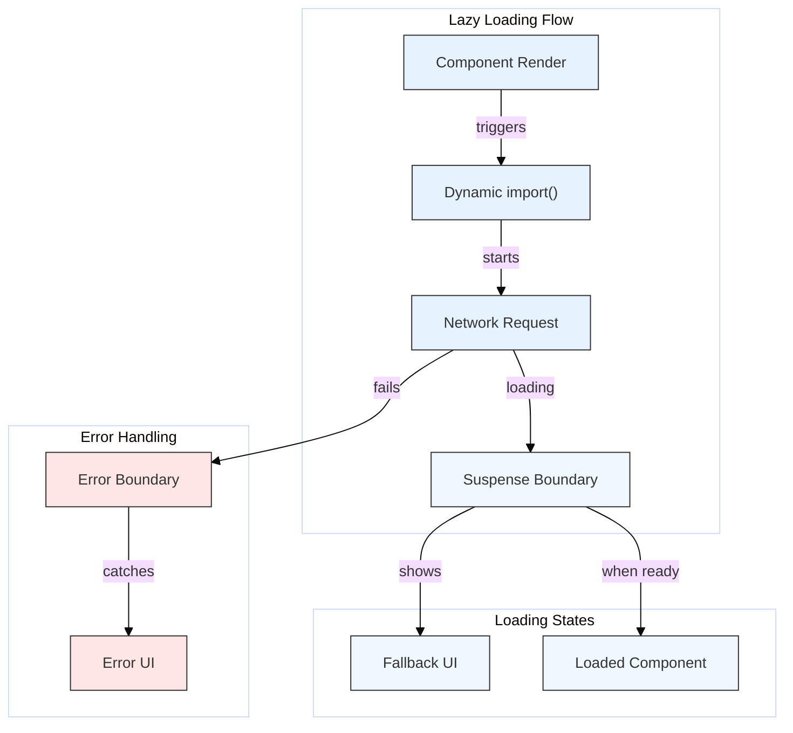

# Optimization: Lazy Loading with Suspense

## Introduction

As React applications grow, their JavaScript bundle size can increase significantly. Large bundles take longer to download and parse, negatively impacting the initial loading performance (Time to Interactive - TTI).

Lazy loading is a technique to address this by splitting the application bundle into smaller chunks and loading components only when they are actually needed, rather than including everything in the initial download.

React provides built-in APIs for code splitting and lazy loading components:
- **`React.lazy()`:** A function that lets you render a dynamically imported component as a regular component.
- **`React.Suspense`:** A component that lets you specify a loading indicator (fallback UI) while lazy-loaded components are being fetched and loaded.

## `React.lazy()`

- **Purpose:** To enable rendering of dynamically imported components.
- **How it Works:**
    - It takes a function as an argument that *must* call a dynamic `import()`. Dynamic `import()` returns a Promise.
    - The Promise resolves to a module object with a `default` export containing the React component.
    - `React.lazy()` handles this Promise internally.
- **Syntax:**
    ```javascript
    const OtherComponent = React.lazy(() => import('./OtherComponent'));
    ```
- **Requirement:** The dynamically imported component **must** be a default export (`export default MyComponent`).

## `React.Suspense`

- **Purpose:** To specify a fallback UI (like a loading spinner or skeleton screen) to show while the children components wrapped by it (including lazy-loaded ones) are loading.
- **How it Works:**
    - You wrap the lazy component(s) within a `<Suspense>` component.
    - You provide a `fallback` prop to `<Suspense>` with the JSX to render during the loading state.
- **Syntax:**
    ```jsx
    import React, { Suspense } from 'react';

    const OtherComponent = React.lazy(() => import('./OtherComponent'));

    function MyComponent() {
      return (
        <div>
          <Suspense fallback={<p>Loading component...</p>}>
            {/* OtherComponent will be loaded when MyComponent renders */}
            <OtherComponent />
          </Suspense>
        </div>
      );
    }
    ```
- **Multiple Components:** You can wrap multiple lazy components inside a single `Suspense` boundary. The fallback will be shown until *all* of them are loaded.

## Benefits

- **Reduced Initial Bundle Size:** Users download less JavaScript code initially, leading to faster load times.
- **Improved TTI:** The application becomes interactive sooner.
- **On-Demand Loading:** Code for features/routes is only loaded when the user navigates to them.

## Diagram: Lazy Loading Flow



## Code Example

Let's imagine `./components/LazyLoadedComponent.js` exists:

```jsx
// ./components/LazyLoadedComponent.js
import React from 'react';

function LazyLoadedComponent({ message }) {
  console.log('LazyLoadedComponent rendered!');
  // Imagine this component is large or uses heavy libraries
  return (
    <div style={{ border: '2px solid green', padding: '10px', margin: '10px' }}>
      <h2>I am Lazy Loaded!</h2>
      <p>Message: {message}</p>
    </div>
  );
}

export default LazyLoadedComponent; // Must be default export
```

Now, use it with `React.lazy` and `Suspense`:

```jsx
// ./App.js
import React, { useState, Suspense } from 'react';

// 1. Import lazy and define the lazy component
const LazyLoadedComponent = React.lazy(() => import('./components/LazyLoadedComponent'));

function App() {
  const [showLazy, setShowLazy] = useState(false);

  return (
    <div>
      <h1>Lazy Loading with Suspense</h1>
      <button onClick={() => setShowLazy(true)}>Load Lazy Component</button>

      {showLazy && (
        // 2. Wrap the lazy component in Suspense with a fallback
        <Suspense fallback={<div style={{ padding: '10px', color: 'blue' }}>Loading... Please wait...</div>}>
          <p>Lazy component wrapper:</p>
          {/* 3. Render the lazy component */} 
          {/* It will only be fetched when showLazy becomes true */}
          <LazyLoadedComponent message="Hello from App!" />
        </Suspense>
      )}
      {!showLazy && 
        <p>Click the button to load the component. Check your network tab!</p>
      }
    </div>
  );
}

export default App;
```

## Considerations

- **Error Handling:** Wrap `Suspense` in an Error Boundary to catch errors that might occur during the loading of the lazy component (e.g., network errors).
- **Routing:** `React.lazy` and `Suspense` are commonly used with routing libraries (like React Router) to lazy-load entire page components based on the current route.
- **Named Exports:** `React.lazy` currently only supports default exports. For named exports, you can create an intermediate module that re-exports as default, or use a slightly different dynamic import syntax:
  ```javascript
  // For named export `MyNamedComponent` in './MyModule'
  const MyLazyComponent = React.lazy(() => 
    import('./MyModule').then(module => ({ default: module.MyNamedComponent }))
  );
  ```

Lazy loading with Suspense is a crucial optimization technique for improving the performance and user experience of larger React applications. 