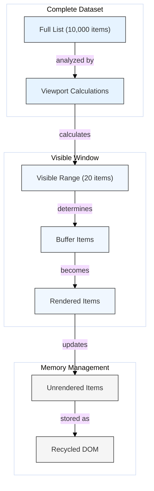

# Optimization: Windowing / Virtualization

## Introduction

Rendering very large lists or grids of data (thousands or tens of thousands of items) can significantly impact React application performance. Even with React's efficient diffing algorithm, creating and managing thousands of DOM nodes and component instances consumes considerable memory and processing power, leading to slow initial renders, sluggish scrolling, and high memory usage.

**Windowing** (also known as **virtualization**) is a technique used to address this problem by rendering only a small subset (a "window") of the items that are currently visible within the viewport, plus a small buffer.

## The Problem with Large Lists

Imagine rendering a list with 10,000 items:

```jsx
function HugeList({ items }) { // items is an array of 10,000 objects
  return (
    <ul>
      {items.map(item => (
        <li key={item.id}>
          {/* Some potentially complex rendering for each item */}
          <ItemContent data={item} /> 
        </li>
      ))}
    </ul>
  );
}
```

Even if only 20 items are visible on the screen at any given time, React still needs to:
- Create 10,000 component instances (`<li>` and `<ItemContent>`).
- Create 10,000+ corresponding DOM nodes.
- Run the reconciliation process across all 10,000 items during updates.
- Keep all these nodes and instances in memory.

This leads to:
- **Slow Initial Render:** Creating thousands of DOM nodes takes time.
- **High Memory Consumption:** Storing nodes and component instances consumes significant memory.
- **Slow Updates:** Diffing a huge list is slower than diffing a small one.
- **Laggy Scrolling:** The browser struggles to render and manage a vast number of off-screen elements.

## How Windowing Works

Windowing libraries work by:
1.  **Calculating Visible Items:** Determining which items *should* be visible based on the scroll container's size, the total number of items, the size of each item, and the current scroll position.
2.  **Rendering Only Visible Items:** Rendering only the components and DOM nodes for the items currently within (or near) the viewport.
3.  **Absolute Positioning:** Using absolute positioning (`position: absolute; top: ...`) within a container element to place the rendered items correctly, simulating the layout of the full list.
4.  **Container Sizing:** Setting the height/width of the scrollable container to match the total size the list *would* occupy if all items were rendered. This ensures the scrollbar behaves correctly.
5.  **Updating on Scroll:** Attaching scroll event listeners to recalculate the visible window and re-render the appropriate subset of items as the user scrolls.

## Diagram: Windowing Concept



## Popular Libraries

Implementing windowing manually is complex. Several popular libraries provide robust and optimized solutions:

- **`react-window`:** A lightweight library providing components (`FixedSizeList`, `VariableSizeList`, `FixedSizeGrid`, `VariableSizeGrid`) for rendering virtualized lists and grids. It's a rewrite of `react-virtualized` focused on smaller size and better performance.
- **`react-virtualized`:** An older, more feature-rich library offering various components and helpers for virtualization, including tables, grids, lists, and measurement tools.
- **`TanStack Virtual` (formerly `react-virtual`):** A headless (UI-agnostic) utility library for virtualization, giving you more control over the rendering and styling.

## Code Example (using `react-window`)

```jsx
import React from 'react';
import { FixedSizeList as List } from 'react-window';

// Assume items is a large array of data, e.g.:
// const items = Array.from({ length: 10000 }, (_, index) => ({ 
//   id: index,
//   name: `Item ${index + 1}`,
//   content: `Content for item ${index + 1}`
// }));

// 1. Define the component for rendering a single row
// Note: `style` prop MUST be passed to the element for positioning
const Row = ({ index, style, data }) => {
  const item = data[index]; // Access item data passed via itemData prop
  console.log(`Rendering Row ${index}`); // Observe how few rows render
  return (
    <div style={style}> {/* Apply the style prop here! */} 
      Item {item.name} - {item.content}
    </div>
  );
};

function VirtualizedList({ items }) {
  return (
    <div>
      <h2>Virtualized List (react-window)</h2>
      <p>Rendering {items.length} items, but only a few are in the DOM.</p>
      {/* 2. Use the virtualization component */}
      <List
        height={400} // Height of the visible scrollable area
        itemCount={items.length} // Total number of items in the list
        itemSize={50} // Height of each row in pixels (must be constant for FixedSizeList)
        width={'100%'} // Width of the list
        itemData={items} // Pass the full items array down (accessible in Row via data prop)
        style={{ border: '1px solid #ccc' }}
      >
        {Row} {/* Pass the Row component to render each item */} 
      </List>
    </div>
  );
}

// Example Usage:
function AppWindowing() {
    const largeListItems = React.useMemo(() => 
        Array.from({ length: 10000 }, (_, index) => ({ 
            id: index,
            name: `Item ${index + 1}`,
            content: `Content for item ${index + 1}`
        })), 
    []);

    return <VirtualizedList items={largeListItems} />;
}

export default AppWindowing;
```

## Considerations

- **Item Size:** `react-window` requires knowing the size (height for lists, width/height for grids) of each item beforehand (`FixedSizeList`) or via a function (`VariableSizeList`). Accurately measuring variable item sizes can sometimes be tricky.
- **Complexity:** Adds a layer of abstraction and requires using specific library components.
- **Accessibility:** Ensure your implementation maintains accessibility (e.g., proper ARIA roles and keyboard navigation), which virtualization can sometimes complicate.
- **Styling:** Items are typically absolutely positioned, which might affect certain CSS layout techniques within list items.

## Conclusion

Windowing/virtualization is an essential optimization technique when dealing with very long lists or large grids in React. By rendering only the visible items, libraries like `react-window` dramatically improve performance, reduce memory usage, and keep the user interface responsive, even with thousands or millions of data points. 