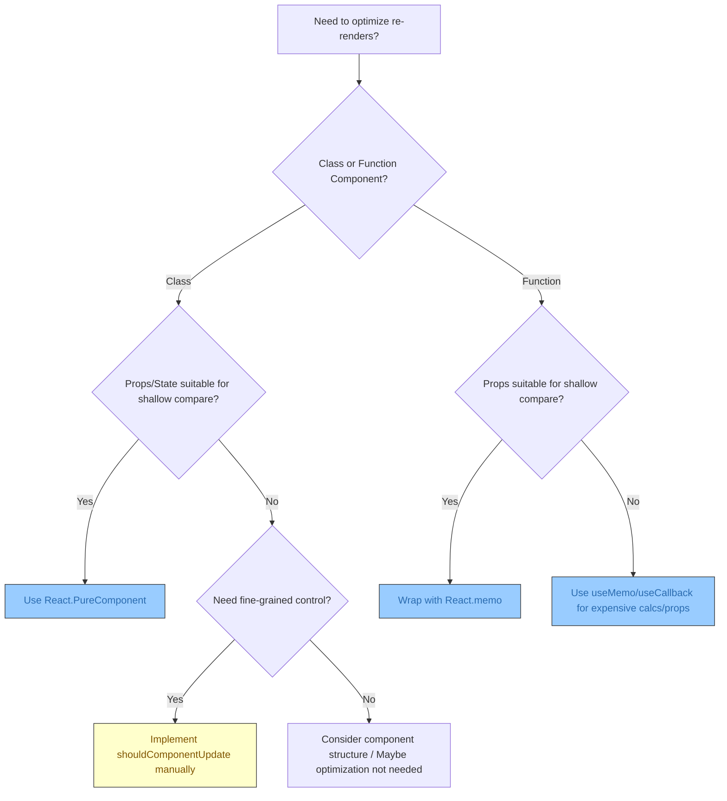
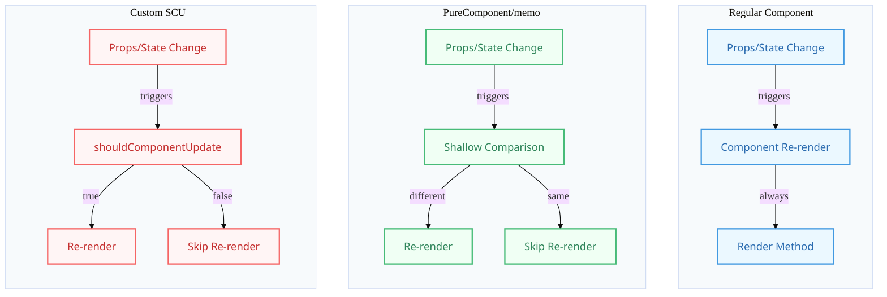

# PureComponent & shouldComponentUpdate

## Introduction

React's rendering process can sometimes be computationally expensive, especially in complex applications. By default, when a component's parent re-renders, the component itself also re-renders, even if its props and state haven't changed. React provides mechanisms to optimize this behavior and prevent unnecessary re-renders: `shouldComponentUpdate` (for class components) and `React.PureComponent` (a specialized base class).

Function components achieve similar optimization using `React.memo`.

## `shouldComponentUpdate(nextProps, nextState)`

- **Purpose:** A lifecycle method available in standard `React.Component` classes.
- **How it Works:** This method is called before the `render` method during the update phase. It receives the upcoming props (`nextProps`) and state (`nextState`) as arguments. You can compare these with the current `this.props` and `this.state` to determine if the component *needs* to re-render.
- **Return Value:**
    - Return `true` (the default behavior if not implemented) to allow the component to re-render.
    - Return `false` to skip the re-render, preventing `render()`, `getSnapshotBeforeUpdate()`, and `componentDidUpdate()` from being called for the current update cycle.
- **Use Case:** Fine-grained control over the re-rendering process based on specific prop/state comparisons (potentially deep comparisons, though this can be costly itself).

```jsx
import React, { Component } from 'react';
import shallowCompare from 'react-addons-shallow-compare'; // Deprecated, use PureComponent or manual shallow compare

class CustomOptimizedComponent extends Component {
  shouldComponentUpdate(nextProps, nextState) {
    console.log('shouldComponentUpdate called');
    // Example: Only update if 'data.id' or 'isActive' state changes
    if (nextProps.data.id !== this.props.data.id || 
        nextState.isActive !== this.state.isActive) {
      console.log('Deciding to update');
      return true; // Re-render
    }
    
    // Example using a basic shallow compare (like PureComponent does)
    // return shallowCompare(this, nextProps, nextState); 
    // Note: shallowCompare is legacy, implement manually if needed

    console.log('Skipping update');
    return false; // Do not re-render
  }

  constructor(props) {
    super(props);
    this.state = { isActive: false };
  }

  render() {
    console.log('CustomOptimizedComponent rendering');
    return (
      <div>
        <p>ID: {this.props.data.id}</p>
        <p>Name: {this.props.data.name}</p>
        <p>Status: {this.state.isActive ? 'Active' : 'Inactive'}</p>
        <button onClick={() => this.setState({ isActive: !this.state.isActive })}>Toggle Active</button>
      </div>
    );
  }
}

export default CustomOptimizedComponent;
```

## `React.PureComponent`

- **Purpose:** A base class, similar to `React.Component`, but provides a default implementation of `shouldComponentUpdate`.
- **How it Works:** Instead of extending `React.Component`, you extend `React.PureComponent`. It automatically implements `shouldComponentUpdate` with a **shallow comparison** of current and next props and state.
- **Shallow Comparison:**
    - For primitive types (string, number, boolean), it compares values directly.
    - For objects and arrays, it compares *references* (identity). It checks if `nextProps.someObject === this.props.someObject`, NOT if the contents of the objects are the same.
- **Use Case:** A convenient way to optimize components when you know that their props and state are either primitive values or objects/arrays whose references only change when their content actually changes (i.e., you avoid mutating props/state directly and always create new objects/arrays for updates).

```jsx
import React, { PureComponent } from 'react';

class OptimizedUserDisplay extends PureComponent {
  // No need to write shouldComponentUpdate!
  // It's implicitly doing a shallow compare on props and state.

  constructor(props) {
    super(props);
    // Example state (though often PureComponents are stateless)
    this.state = { hover: false }; 
  }

  render() {
    // Props received: user (object), highlight (boolean)
    const { user, highlight } = this.props;
    console.log(`Rendering OptimizedUserDisplay for ${user.name}`);

    return (
      <div 
        style={{ border: highlight ? '2px solid red' : '1px solid grey', padding: '10px', margin: '5px' }}
        onMouseEnter={() => this.setState({ hover: true })}
        onMouseLeave={() => this.setState({ hover: false })}
      >
        <p>Name: {user.name} (ID: {user.id})</p>
        {this.state.hover && <p>Hovering!</p>}
      </div>
    );
  }
}

class ParentComponent extends React.Component {
  state = {
    users: [
      { id: 1, name: 'Alice' },
      { id: 2, name: 'Bob' },
    ],
    highlightedUserId: null,
    counter: 0 // Used to force parent re-render
  };

  highlightUser = (id) => {
    this.setState({ highlightedUserId: id });
  }

  // IMPORTANT: Avoid creating new objects/arrays if data hasn't changed
  updateUserName = (id, newName) => {
    this.setState(prevState => ({
      users: prevState.users.map(user => 
        user.id === id ? { ...user, name: newName } : user // Create NEW user object only for the changed one
      )
    }));
  }

  forceParentRender = () => {
    // This state change doesn't affect OptimizedUserDisplay props directly
    this.setState({ counter: this.state.counter + 1 });
  }

  render() {
    console.log('ParentComponent rendering');
    return (
      <div>
        <button onClick={this.forceParentRender}>Force Parent Re-render ({this.state.counter})</button>
        <button onClick={() => this.updateUserName(1, `Alice-${Date.now()}`)}>Update Alice's Name</button>
        {this.state.users.map(user => (
          <OptimizedUserDisplay 
            key={user.id} 
            user={user} // Pass the user object
            highlight={user.id === this.state.highlightedUserId}
            // onClickHandler={() => this.highlightUser(user.id)} // BAD: Creates new function reference on every render!
            // onClickHandler={this.highlightUser.bind(this, user.id)} // Also BAD: Creates new function reference!
            // Correct: Pass method reference if possible, or use useCallback in function components
          />
        ))}
      </div>
    );
  }
}

export default ParentComponent;
```

## Pitfalls with Shallow Comparison (`PureComponent` / `React.memo`)

- **Mutations:** If you mutate objects or arrays within props/state directly (e.g., `this.props.user.name = 'new name'; this.setState({})`), shallow comparison won't detect the change because the object/array reference remains the same. Always create new objects/arrays for updates.
- **New Function References:** Passing inline arrow functions or using `.bind` directly in the `render` method creates new function references on every parent render (e.g., `<button onClick={() => this.handleClick(id)}>`). This will cause a `PureComponent` child receiving that function as a prop to re-render unnecessarily. Define handlers as class methods or use `useCallback` in function components.

## Diagram: Optimization Choice

### Original Flow


### Enhanced Visualization


`PureComponent` and `shouldComponentUpdate` are tools for optimizing class component performance by preventing unnecessary renders, with `PureComponent` being the simpler option when shallow comparison is sufficient. 