# React 18+: Concurrent Rendering

## Introduction

Concurrent Rendering (often referred to as "Concurrency") is the flagship feature introduced in React 18. It represents a fundamental change to React's rendering mechanism, allowing React to work on multiple state updates *concurrently* and interrupt, pause, or resume rendering work.

Concurrency itself isn't a specific API feature you directly use everywhere, but rather an underlying capability that **enables** new features like `useTransition`, `useDeferredValue`, Suspense for data fetching, and improved performance/responsiveness out-of-the-box (like automatic batching).

## How it Differs from Traditional Rendering

- **Traditional (Blocking) Rendering:** Before React 18 (or without using concurrent features), rendering was typically blocking. Once React started rendering an update, it couldn't be interrupted until the entire component tree was processed and committed to the DOM. Large updates could freeze the main thread, making the UI unresponsive to user input.
- **Concurrent Rendering:** React can start rendering an update, pause it mid-way to handle a more urgent update (like user input), and then resume the previous rendering work later, or even discard it if it became stale.

## Key Concepts

- **Interruptible Rendering:** The core idea. React can pause rendering work for a low-priority update if a high-priority update (like typing in an input) comes in.
- **Prioritization:** React can prioritize updates. User interactions are typically high priority, while background data fetching or transitions are lower priority.
- **Cooperative Scheduling:** React yields control back to the browser periodically during rendering, ensuring the main thread doesn't remain blocked for long periods.
- **State Consistency:** Despite interruptions, React guarantees that the UI remains consistent and doesn't show half-finished states from different updates simultaneously.

## Enabling Concurrency

Concurrency is enabled automatically when you use a **concurrent feature**. You don't typically turn concurrency "on" globally; you opt into it by using features that require it:

- `createRoot`: Using the new `createRoot` API (instead of the legacy `ReactDOM.render`) to render your app is the entry point for enabling concurrent features.
- `startTransition` (via `useTransition`): Explicitly marks state updates as non-urgent transitions, allowing them to be interrupted.
- `useDeferredValue`: Allows deferring updates for a specific value, showing stale content while fresh content renders concurrently.
- **Suspense for Data Fetching:** (Still evolving, often used with frameworks like Relay or Next.js) Allows components to "suspend" rendering while data is being fetched, without blocking siblings.

## Benefits

- **Improved Responsiveness:** Applications remain responsive to user input even during large rendering updates or complex background tasks.
- **Smoother User Experience:** Reduces UI jank and freezing, especially on complex pages or slower devices.
- **New UI Patterns:** Enables patterns like showing stale content while fresh content loads, graceful loading sequences, and offscreen rendering.
- **Better Performance Perception:** Even if total work takes the same time, breaking it up and prioritizing user interactions makes the app *feel* faster.

## Diagram: Blocking vs. Concurrent Rendering

### Original (Fixed)


### Enhanced Visualization

```mermaid
%%{init: { 
    'theme': 'base', 
    'themeVariables': { 
        'fontSize': '16px',
        'fontFamily': 'system-ui, -apple-system, sans-serif',
        'textColor': '#2D3748',
        'mainBkg': '#ffffff',
        'nodeBorder': '#4A5568',
        'clusterBkg': '#f7fafc'
    }
}}%%
graph TD
    subgraph Blocking["Synchronous Rendering"]
        direction TB
        A1["State Update"] -->|"1. triggers"| B1["Render Phase"]
        B1 -->|"2. blocks UI"| C1["🚫 Blocked Browser"]
        C1 -->|"3. waits"| D1["Commit Phase"]
        D1 -->|"4. updates"| E1["DOM"]
    end

    subgraph Concurrent["Concurrent Rendering"]
        direction TB
        A2["State Update"] -->|"1. triggers"| B2["Interruptible Render"]
        B2 -->|"2. yields"| C2["✅ Responsive Browser"]
        C2 -->|"3. continues"| B2
        B2 -->|"4. ready"| D2["Commit Phase"]
        D2 -->|"5. updates"| E2["DOM"]
    end

    %% Styling
    classDef default font-family:system-ui,-apple-system,sans-serif,font-size:16px,font-weight:normal
    classDef blocking fill:#FFF5F5,stroke:#F56565,stroke-width:2px,color:#C53030
    classDef concurrent fill:#F0FFF4,stroke:#48BB78,stroke-width:2px,color:#2F855A
    classDef browser fill:#EBF8FF,stroke:#4299E1,stroke-width:2px,color:#2B6CB0
    classDef commit fill:#FAF5FF,stroke:#805AD5,stroke-width:2px,color:#553C9A

    %% Apply styles
    class A1,B1,D1,E1 blocking
    class A2,B2,D2,E2 concurrent
    class C1 blocking
    class C2 browser
```


## Code Example (Conceptual Illustration)

While concurrency itself isn't directly coded, using `useTransition` shows its effect. (See Advanced Hooks -> `useTransition` for a detailed example).

```jsx
import React, { useState, useTransition } from 'react';

function ConcurrentDemo() {
  const [value, setValue] = useState('');
  const [listItems, setListItems] = useState([]);
  const [isPending, startTransition] = useTransition();

  const handleChange = (e) => {
    // High-priority update: Update the input field immediately
    setValue(e.target.value);

    // Low-priority update: Update the list (can be interrupted)
    startTransition(() => {
      // Simulate expensive list generation
      const newList = Array.from({ length: 10000 }, (_, i) => 
          `Item ${i} for ${e.target.value}`
      );
      setListItems(newList);
    });
  };

  // Concurrency allows the input field (value) to update and render quickly,
  // even if the startTransition update (setListItems) takes longer. 
  // React can interrupt the list update rendering if needed.

  return (
    <div>
      <input type="text" value={value} onChange={handleChange} />
      {isPending ? <p> Loading list...</p> : null}
      <ul>
        {/* Render potentially large list */}
        {/* In a concurrent render, this list update might be paused/resumed */}
        {listItems.slice(0, 10).map(item => <li key={item}>{item}</li>)} 
        {listItems.length > 10 && <li>... and {listItems.length - 10} more</li>}
      </ul>
    </div>
  );
}

export default ConcurrentDemo;
```

## Conclusion

Concurrent Rendering is a powerful new paradigm in React 18 that makes applications more responsive and enables new UI patterns. While much of its benefit comes automatically when using `createRoot`, leveraging concurrent features like `useTransition` and `useDeferredValue` allows developers to fine-tune application behavior and performance by explicitly marking updates as non-urgent. 