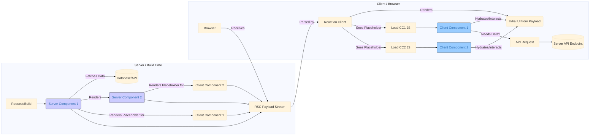
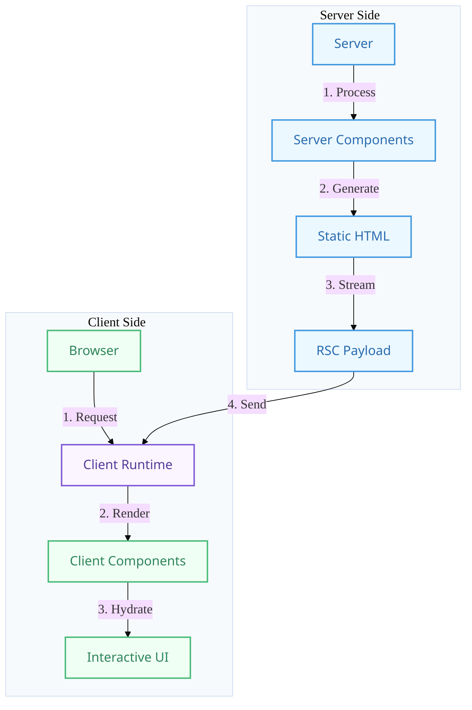

# React 18+: React Server Components (RSC)

## Introduction

React Server Components (RSC) are a major architectural shift introduced by the React team, enabling components to run exclusively on the server or even during the build process. This allows for building applications with potentially zero client-side JavaScript for parts of the UI, leading to significant performance improvements.

RSCs work alongside traditional **Client Components** (the components we've typically written in React so far). This new architecture allows developers to choose the best environment for each component based on its needs.

**Important Note:** RSC is a relatively new and evolving technology. Its implementation details and best practices are heavily tied to frameworks that support it, such as **Next.js (App Router)** and potentially Remix in the future. Using RSC often involves framework-specific conventions.

## Server Components vs. Client Components

1.  **Server Components (`.js`, `.jsx`, `.ts`, `.tsx` by default in Next.js App Router):**
    - **Run Environment:** Exclusively on the server (or during build).
    - **Client-Side JS:** Send **no** JavaScript code to the client.
    - **Capabilities:**
        - Can directly access server-side resources (databases, file systems, internal APIs) without needing separate API endpoints.
        - Can use `async/await` for data fetching directly within the component.
        - Cannot use Hooks that rely on client-side state or effects (`useState`, `useEffect`, `useReducer`, `useContext`, etc.).
        - Cannot use browser APIs (like `window` or `localStorage`).
        - Cannot use event listeners (`onClick`, `onChange`, etc.).
    - **Output:** Render to an intermediate format (often called the "RSC Payload") that describes the UI, which React then uses on the client to update the DOM.

2.  **Client Components (`"use client";` directive at the top):**
    - **Run Environment:** Render initially on the server (for SSR/SSG in frameworks) and then "hydrate" and run on the client.
    - **Client-Side JS:** Send JavaScript code to the client to enable interactivity.
    - **Capabilities:**
        - Can use all traditional React Hooks (`useState`, `useEffect`, etc.).
        - Can use browser APIs.
        - Can use event listeners for interactivity.
        - Cannot directly access server-side resources (must fetch data via API calls, typically within `useEffect` or framework-specific data fetching hooks).

3.  **Shared Components:**
    - Components that don't have the `"use client";` directive and don't use server-only features *might* run on either the server or the client, depending on where they are imported from. Their behavior needs to be compatible with both environments.

## How it Works (Conceptual)

1.  **Request:** A request comes into the server (or build process starts).
2.  **Server Rendering:** React renders the Server Components on the server.
    - Data fetching happens directly.
    - The output is an RSC Payload (a description of the UI, including rendered Client Component placeholders).
3.  **Streaming:** The RSC Payload is streamed to the client.
4.  **Client Rendering:**
    - React on the client receives the payload.
    - It renders the UI described by the payload.
    - For placeholders representing Client Components, React downloads their JavaScript code (if not already cached) and renders them.
    - Client Components then hydrate, attaching event listeners and running effects.

Server Components can render other Server Components, Client Components, or Shared Components. Client Components can only render other Client or Shared Components (they cannot directly render Server Components, though they can receive them as `children` props passed down from a Server Component parent).

## Benefits

- **Reduced Client-Side JavaScript:** Server Components send no JS, significantly reducing bundle sizes for parts of the app, leading to faster loads and TTI.
- **Direct Backend Access:** Simplifies data fetching by allowing components to access data sources directly on the server, eliminating the need for separate API layers in many cases.
- **Improved Performance:** Reduces the amount of code downloaded, parsed, and executed on the client, especially beneficial for low-powered devices or slow networks.
- **Automatic Code Splitting:** Frameworks often automatically code-split Client Components.
- **Enhanced Security:** Keeps sensitive data and logic on the server, never exposing it to the client.

## Limitations & Considerations

- **Interactivity:** Server Components cannot be interactive (no `useState`, `useEffect`, event handlers).
- **Client State:** Cannot directly use client-side state or browser APIs.
- **Framework Dependence:** Implementation is currently tied to adopting frameworks like Next.js App Router.
- **Learning Curve:** Requires understanding the different component types and their constraints.
- **Data Fetching Patterns:** Shifts data fetching logic directly into components, requiring different patterns than traditional client-side fetching.

## Diagram: RSC Architecture

### Original Flow


### Enhanced Visualization


## Code Example (Next.js App Router Syntax)

```jsx
// app/page.js (Server Component by default)
import ClientButton from './ClientButton';
import ServerDataDisplay from './ServerDataDisplay';

// Can directly fetch data using async/await
async function getData() {
  // Imagine fetching from DB or internal API
  await new Promise(resolve => setTimeout(resolve, 50)); // Simulate delay
  return { message: 'Data fetched on the server!' };
}

export default async function HomePage() {
  const data = await getData();

  // Cannot use useState, useEffect, onClick here
  
  return (
    <div>
      <h1>React Server Components Demo</h1>
      <p>This is rendered on the server.</p>
      
      {/* Render another Server Component */}
      <ServerDataDisplay serverData={data.message} />
      
      {/* Render a Client Component */}
      {/* Server components can pass props to Client components */}
      <ClientButton initialCount={5} />
      
      {/* Can pass Server Components AS CHILDREN to Client Components */}
      {/* <ClientWrapper>
            <ServerDataDisplay serverData="Passed as child!" />
         </ClientWrapper> */}
    </div>
  );
}

// app/ServerDataDisplay.js (Server Component)
export default function ServerDataDisplay({ serverData }) {
  // This also runs only on the server
  console.log('Rendering ServerDataDisplay on server');
  return <p style={{ border: '1px solid green', padding: '5px' }}>Server Data: {serverData}</p>;
}

// app/ClientButton.js (Client Component)
'use client'; // Directive marks this as a Client Component

import React, { useState } from 'react';

export default function ClientButton({ initialCount }) {
  // Can use Hooks like useState and event handlers
  const [count, setCount] = useState(initialCount || 0);
  console.log('Rendering ClientButton (on client during hydration/updates)');

  // Cannot fetch data directly here (would need useEffect + fetch)

  return (
    <button 
        onClick={() => setCount(c => c + 1)} 
        style={{ border: '1px solid blue', padding: '5px', margin: '5px' }}
    >
      Client Counter: {count}
    </button>
  );
}
```

## Conclusion

React Server Components represent a significant evolution, enabling developers to build faster, lighter applications by strategically moving component rendering and data fetching to the server. While still evolving and requiring framework support, RSC offers a powerful way to optimize performance by reducing client-side JavaScript and simplifying data access for parts of the UI that don't require client-side interactivity. 