# Philosophy: Unidirectional Data Flow

## Introduction

Unidirectional Data Flow is a core architectural principle in React that dictates how data moves through your application. It means that data has **one, and only one, way** to be transferred to other parts of the application.

In React, this typically means:
1.  **State lives in specific components** (often higher-level "container" or "smart" components, or in a central store).
2.  **Data flows down** from parent components to child components via **props**.
3.  **Actions flow up** from child components to parent components via **callback functions** passed down as props.

This pattern makes the application state more predictable and easier to debug, as changes to the state follow a clear, traceable path.

## How it Works

- **State Ownership:** A component owns its state. Only it can directly modify its own state (using `setState` or `dispatch` from `useReducer`).
- **Props Down:** Parent components pass data (derived from their state or props) down to their children as props. Child components receive this data as read-only.
- **Callbacks Up:** If a child component needs to modify state that lives in a parent (or ancestor), the parent passes down a function (callback) as a prop. The child calls this function when an event occurs (like a button click), effectively sending a message or "action" up to the parent, which then handles the state update.

This contrasts with **bidirectional data flow** (found in some other frameworks, like early versions of Angular with `ngModel`), where changes in a child component could directly modify the parent's state, making the flow harder to track.

## Benefits

- **Predictability:** State changes are explicit and easier to follow. You know where data comes from (props down) and how state updates are triggered (callbacks up).
- **Debugging:** When something goes wrong, tracing the data flow is simpler. You can track props down the tree and callbacks up the tree to find where state changes originate or where incorrect data is passed.
- **Maintainability:** Decouples components. Child components don't need to know *how* the state is managed, only what data they receive and what callbacks to call.
- **Performance:** Easier for React (and developers) to reason about and optimize rendering, as changes flow in a single direction.

## Diagram: Unidirectional Data Flow

### Original Flow


### Enhanced Visualization

```mermaid
graph TD
    subgraph Flow["Unidirectional Data Flow"]
        direction TB
        A1["📦 Parent State"] -->|"props"| B1["🔽 Child Props"]
        B1 -->|"render"| C1["👁️ Child View"]
        C1 -->|"event"| D1["⬆️ Event Handler"]
        D1 -->|"update"| A1
    end

    %% Styling
    classDef state fill:#EBF8FF,stroke:#4299E1,stroke-width:2px,color:#2B6CB0,font-size:18px
    classDef props fill:#F0FFF4,stroke:#48BB78,stroke-width:2px,color:#2F855A,font-size:18px
    classDef event fill:#FEFCBF,stroke:#ECC94B,stroke-width:2px,color:#975A16,font-size:18px

    %% Apply styles
    class A1 state
    class B1,C1 props
    class D1 event
```


## Code Example

```jsx
import React, { useState } from 'react';

// Child component receives data (count) and a callback (onIncrement) via props.
function ChildDisplay({ count, onIncrement }) {
  console.log('Rendering ChildDisplay');
  return (
    <div style={{ border: '1px solid blue', padding: '10px', marginTop: '10px' }}>
      <p>Child Component</p>
      <p>Received Count: {count}</p>
      {/* When button is clicked, it calls the callback passed from the parent */}
      <button onClick={onIncrement}>Increment from Child</button>
    </div>
  );
}

// Parent component owns the state and the logic to update it.
function ParentContainer() {
  // 1. State lives in the parent
  const [parentCount, setParentCount] = useState(0);
  console.log('Rendering ParentContainer');

  // 3. Callback function defined in the parent to update its state
  const handleIncrement = () => {
    console.log('Parent handleIncrement called');
    setParentCount(currentCount => currentCount + 1);
  };

  return (
    <div style={{ border: '1px solid red', padding: '10px' }}>
      <h2>Unidirectional Data Flow Demo</h2>
      <p>Parent Component</p>
      <p>Parent Count State: {parentCount}</p>
      {/* 2. Data (parentCount) and Callback (handleIncrement) flow down via props */}
      <ChildDisplay 
        count={parentCount} 
        onIncrement={handleIncrement} 
      />
    </div>
  );
}

export default ParentContainer;
```

In this example:
- `ParentContainer` owns the `parentCount` state.
- `parentCount` flows down to `ChildDisplay` as the `count` prop.
- `handleIncrement` function flows down to `ChildDisplay` as the `onIncrement` prop.
- When the button in `ChildDisplay` is clicked, it calls `onIncrement`, which triggers `handleIncrement` in the `ParentContainer`, updating the parent's state.
- The parent re-renders, passing the new `parentCount` down to the child, causing it to re-render with the updated value.

## Conclusion

Unidirectional data flow is a key principle that contributes significantly to React's predictability and maintainability. By ensuring data flows down via props and actions flow up via callbacks, applications become easier to understand, debug, and scale. 