# Render Phase vs Commit Phase

## Introduction

In React (especially since the introduction of the Fiber architecture in React 16), the work involved in updating the UI is conceptually divided into two main phases:

1.  **Render Phase:** Determines what changes need to be made.
2.  **Commit Phase:** Applies those changes to the DOM.

Understanding this separation is crucial for grasping how React achieves concurrency and handles side effects correctly.

## Render Phase

- **Purpose:** To create a "work-in-progress" fiber tree representing the desired UI state based on the latest props and state. This involves calling component render methods (for classes) or function components themselves.
- **Characteristics:**
    - **Pure:** This phase should be free of side effects (like DOM manipulation, network requests, or setting subscriptions). It's purely about calculating the next state of the UI.
    - **Interruptible:** React Fiber can pause, abort, or restart the work in the render phase if higher-priority updates come in. This means the render phase might run multiple times for a single update before committing.
    - **Asynchronous (Conceptually):** While parts might run synchronously, the overall phase can be spread across multiple frames thanks to Fiber's scheduling capabilities.
- **Activities:**
    - Calling `render()` for class components.
    - Calling function components.
    - Diffing the new element tree with the old one.
    - Calculating necessary DOM changes.

## Commit Phase

- **Purpose:** To apply the changes calculated during the render phase to the actual host environment (e.g., the browser DOM).
- **Characteristics:**
    - **Side Effects Allowed:** This is the phase where side effects related to the DOM update should occur.
    - **Not Interruptible:** Once React starts the commit phase, it runs synchronously to completion to ensure a consistent UI state. Interrupting this phase could lead to inconsistencies or visual glitches.
    - **Synchronous:** Runs in a single, uninterruptible sequence.
- **Activities:**
    - Performing DOM insertions, updates, and deletions.
    - Running `componentDidMount`, `componentDidUpdate`, `componentWillUnmount` lifecycle methods (for class components).
    - Running `useLayoutEffect` hooks (synchronously after DOM mutations but before paint).
    - Running `useEffect` hooks (asynchronously after paint).
    - Updating refs (`ref.current` is assigned).

## Diagram: Render and Commit Phases

### Original Flow


### Enhanced Visualization

```mermaid
graph TD
    subgraph Render["Render Phase"]
        direction TB
        A1["🔄 State Change"] -->|"1. triggers"| B1["⚛️ React Processing"]
        B1 -->|"2. builds"| C1["🌳 Virtual DOM"]
        C1 -->|"3. compares"| D1["📋 Change List"]
    end

    subgraph Commit["Commit Phase"]
        direction TB
        E1["🔨 DOM Updates"] -->|"4. applies to"| F1["🖥️ Real DOM"]
        F1 -->|"5. reflects in"| G1["👀 Browser View"]
    end

    D1 -->|"initiates"| E1

    %% Styling
    classDef render fill:#FFF5F5,stroke:#F56565,stroke-width:2px,color:#C53030,font-size:18px
    classDef virtual fill:#F0FFF4,stroke:#48BB78,stroke-width:2px,color:#2F855A,font-size:18px
    classDef commit fill:#EBF8FF,stroke:#4299E1,stroke-width:2px,color:#2B6CB0,font-size:18px

    %% Apply styles
    class A1,B1 render
    class C1,D1 virtual
    class E1,F1,G1 commit
```


## Code Example: Effects in Phases

This example demonstrates when `useLayoutEffect` and `useEffect` run relative to the commit phase and painting.

```jsx
import React, { useState, useLayoutEffect, useEffect, useRef } from 'react';

function PhaseDemo() {
  const [count, setCount] = useState(0);
  const buttonRef = useRef();

  // Render Phase: This logic runs during rendering.
  // It should be pure. Logging here is for demonstration only.
  console.log('Render Phase: Calculating UI for count', count);

  // Commit Phase - useLayoutEffect: Runs synchronously *after* DOM mutations
  // but *before* the browser paints the changes.
  // Useful for measuring DOM elements or synchronous updates.
  useLayoutEffect(() => {
    console.log('Commit Phase (useLayoutEffect): DOM updated, before paint.');
    // Example: Read layout immediately after DOM update
    if (count > 0) {
      const { width } = buttonRef.current.getBoundingClientRect();
      console.log('Commit Phase (useLayoutEffect): Button width:', width);
    }
    // Avoid computationally heavy work here as it blocks paint.
  }, [count]);

  // Commit Phase - useEffect: Runs asynchronously *after* the commit phase
  // is complete and the browser has painted the changes.
  // Suitable for most side effects (data fetching, subscriptions).
  useEffect(() => {
    console.log('Commit Phase (useEffect): Runs after paint.');
    document.title = `Count: ${count}`;
    // This doesn't block the browser painting.
  }, [count]);

  const handleClick = () => {
    setCount(c => c + 1);
  };

  console.log('Render Phase: Returning JSX');
  return (
    <div>
      <p>Count: {count}</p>
      <button ref={buttonRef} onClick={handleClick}>Increment</button>
      <p>Check the console to see phase order.</p>
    </div>
  );
}

export default PhaseDemo;

```

When you click the button:
1.  **Render Phase:** Logs "Render Phase..." messages.
2.  **Commit Phase:** React updates the DOM (changes the text in the `<p>` tag).
3.  **Commit Phase (`useLayoutEffect`):** Logs "Commit Phase (useLayoutEffect)..." synchronously.
4.  **Browser Paint:** The browser paints the updated count on the screen.
5.  **Commit Phase (`useEffect`):** Logs "Commit Phase (useEffect)..." asynchronously after paint, and updates the document title. 