# Smart vs Dumb Components (Container vs Presentational)

## Introduction

The "Smart vs Dumb" components pattern, also widely known as "Container vs Presentational" components, is a design pattern used in React (and other frameworks) to separate concerns within your UI components. It helps in creating more reusable, understandable, and maintainable component structures.

- **Smart Components (Containers):** Concerned with *how things work*. They manage state, fetch data, handle logic, and pass data and callbacks down to their children.
- **Dumb Components (Presentational):** Concerned with *how things look*. They receive data and callbacks via props and render UI elements. They typically don't have their own state (or only minimal UI state) and don't interact directly with data sources or external state management.

*Note: With the advent of Hooks, the lines can sometimes blur, as function components can easily manage their own state. However, the core principle of separating data/logic concerns from presentation concerns remains valuable.* 

## Characteristics

**Smart Components (Containers):**
- Often are class components (historically) or function components using Hooks extensively (`useState`, `useEffect`, `useContext`, `useReducer`).
- May interact with Redux, Zustand, Context API, or other state management solutions.
- Perform data fetching or other side effects.
- Pass data (like objects or arrays) and callbacks (functions) down to presentational components via props.
- Rarely have complex styling themselves; they compose presentational components.
- Provide the data source and behavior for child components.

**Dumb Components (Presentational):**
- Primarily receive data and functions through `props`.
- Focus solely on rendering UI based on the props received.
- Often stateless function components (or have only minor UI-related state, like whether a dropdown is open).
- Have no dependency on the rest of the app (data sources, state management stores).
- Can be easily reused in different parts of the application with different data sources.
- Often contain the majority of the markup and styles.

## Benefits

- **Reusability:** Dumb components are highly reusable as they are independent of specific data sources or application logic.
- **Separation of Concerns:** Clear distinction between logic/data handling and UI presentation makes the codebase easier to understand and reason about.
- **Maintainability:** Changes to UI appearance (in dumb components) are less likely to break application logic (in smart components), and vice versa.
- **Testability:** Dumb components are easy to test by simply passing props and asserting the rendered output. Smart components can be tested for their logic, potentially mocking the presentational children.
- **Collaboration:** Designers can often work on dumb components with minimal JavaScript knowledge, while developers focus on the logic in smart components.

## Diagram: Smart/Dumb Relationship

### Original Flow


### Enhanced Visualization

```mermaid
graph TD
    subgraph Smart["Smart Components"]
        direction TB
        A1["🧠 Container Component"] -->|"manages"| B1["📊 State"]
        A1 -->|"handles"| C1["🔄 Data Fetching"]
        A1 -->|"processes"| D1["⚙️ Business Logic"]
    end

    subgraph Dumb["Dumb Components"]
        direction TB
        E1["🎨 Presentational"] -->|"defines"| F1["🖼️ UI Layout"]
        E1 -->|"accepts"| G1["📝 Props"]
        E1 -->|"applies"| H1["💅 Styling"]
    end

    A1 -->|"provides data to"| E1

    %% Styling
    classDef smart fill:#EBF8FF,stroke:#4299E1,stroke-width:2px,color:#2B6CB0,font-size:18px
    classDef dumb fill:#F0FFF4,stroke:#48BB78,stroke-width:2px,color:#2F855A,font-size:18px
    classDef detail fill:#FEFCBF,stroke:#ECC94B,stroke-width:2px,color:#975A16,font-size:18px

    %% Apply styles
    class A1 smart
    class E1 dumb
    class B1,C1,D1,F1,G1,H1 detail
```


## Code Example: User List

```jsx
import React, { useState, useEffect } from 'react';

//---------------------------
// Dumb/Presentational Component
//---------------------------
function UserListDisplay({ users, isLoading, error, onSelectUser }) {
  console.log('Rendering UserListDisplay (Dumb)');
  
  if (isLoading) {
    return <p>Loading users...</p>;
  }

  if (error) {
    return <p style={{ color: 'red' }}>Error: {error}</p>;
  }

  if (!users || users.length === 0) {
    return <p>No users found.</p>;
  }

  // Receives data and callbacks via props
  // Focuses only on rendering the list
  return (
    <ul style={{ listStyle: 'none', padding: 0 }}>
      {users.map(user => (
        <li key={user.id} style={{ border: '1px solid #eee', padding: '10px', margin: '5px' }}>
          <p><strong>{user.name}</strong> ({user.email})</p>
          <button onClick={() => onSelectUser(user.id)}>Select</button>
        </li>
      ))}
    </ul>
  );
}

//---------------------------
// Smart/Container Component
//---------------------------
function UserListContainer() {
  console.log('Rendering UserListContainer (Smart)');
  const [users, setUsers] = useState([]);
  const [isLoading, setIsLoading] = useState(false);
  const [error, setError] = useState(null);
  const [selectedUserId, setSelectedUserId] = useState(null);

  // Handles data fetching (side effect)
  useEffect(() => {
    setIsLoading(true);
    setError(null);
    fetch('https://jsonplaceholder.typicode.com/users?_limit=5')
      .then(response => {
        if (!response.ok) throw new Error('Failed to fetch');
        return response.json();
      })
      .then(data => {
        setUsers(data);
      })
      .catch(err => {
        setError(err.message);
      })
      .finally(() => {
        setIsLoading(false);
      });
  }, []); // Fetch only once on mount

  // Handles logic (callback passed down)
  const handleSelectUser = (userId) => {
    console.log(`User selected in Container: ${userId}`);
    setSelectedUserId(userId);
    // Could perform other actions here
  };

  // Passes state and callbacks down to the presentational component
  return (
    <div>
      <h2>User List (Smart/Dumb Pattern)</h2>
      {selectedUserId && <p>Selected User ID: {selectedUserId}</p>}
      <UserListDisplay 
        users={users}
        isLoading={isLoading}
        error={error}
        onSelectUser={handleSelectUser}
      />
    </div>
  );
}

export default UserListContainer;
```

In this example, `UserListContainer` fetches data and manages loading/error states (smart), while `UserListDisplay` simply takes that data and renders the list UI (dumb). 